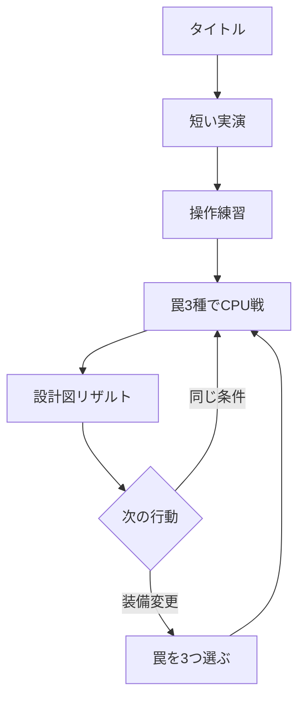

# ワナワナ リッチブラウザゲーム実装計画書

| 項目 | 内容 |
|---|---|
| 文書版 | 0.1（初期実装の基準案） |
| 作成日 | 2026-08-13 |
| 対象 | `chameleonjp-lab/wanawana` |
| 正式対象 | iPhoneの縦持ち。パソコン操作にも対応 |
| 1.0の対戦形式 | プレイヤー対CPU。オンライン対戦は将来候補 |
| 公開方式 | GitHub Pagesを予定。公開設定は完成判定後 |

> この文書の数値は、外部作品の正解を写したものではない。実装を始めるための初期値であり、最初の試遊と自動対戦の記録から更新する。

## 1. 結論

「ワナワナ」は、銃撃で体力を削る作品ではなく、**罠を置き、相手の動きを読み、弱い誘導弾で進路を変え、複数の罠へつなぐ1対1の対戦ゲーム**として作る。

作品として守る約束は、次の4点とする。

| 約束 | 実装で守ること |
|---|---|
| 見えないが、理不尽ではない | 設置動作、接近時の危険表示、調査、解除、試合後の全配置公開を用意する |
| 自分で連鎖を作れる | 押す、遅くする、吹き飛ばす、落とすという役割を明確に分ける |
| 銃は誘導の道具 | 誘導弾の直接ダメージは0とし、罠でのみ体力が減る |
| 負けが次の知識になる | 結果画面の「設計図」で移動経路、罠の位置、発動順、敗因を見せる |

最初からオンライン対戦を作ると、通信、切断、不正対策が遊びの検証を妨げる。したがって1.0はCPU戦に絞る。同じ画面を二人で見る形式は、隠した罠が見えてしまうため採用しない。オンラインは、CPU戦でコアループの面白さを確認した後に別計画で判断する。

## 2. 4つの責任者から見た完成像

| 視点 | 最も重く見ること | 完成を妨げる状態 |
|---|---|---|
| ゲームプロダクトマネージャー | 初見でも始められ、短い試合を再戦したくなる | 機能は多いが、連鎖を作る前に離脱する |
| ゲームクリエイター | 静かな仕込みから派手な連鎖へ変わる感情の波 | 粒や光は多いが、何が起きたか分からない |
| ゲームデザイナー | 隠す、読む、誘う、解除する選択が公平につながる | 待ち伏せ、射撃、CPUの隠し情報参照だけが強い |
| ゲームシニアエンジニア | ルールと描画を分け、再現できる試合を安全に届ける | 画面速度で勝敗が変わり、修正のたびに別の罠が壊れる |

## 3. ゲームプロダクトマネージャー視点

### 3.1 対象と利用場面

主な対象は、iPhoneで3〜5分の短い対戦を楽しみたい人とする。複雑な入力や長い育成より、読み合い、いたずら、逆転、連鎖の気持ちよさを好む人を想定する。パソコンでも遊べるようにするが、初版の品質判断はiPhoneを優先する。

1.0では、本格的な順位戦、多数のキャラクター収集、課金、アカウント、長い物語を対象にしない。タイトル画面には「対CPU 1対1罠バトル」と明記し、対人戦があるように見せない。

### 3.2 1回の利用体験

初回起動から再戦までを、次の流れに固定する。



通常の1試合は150秒とし、結果確認まで含めて3〜5分を目標にする。初回だけは固定された3種類の罠で始め、装備選択を挟まない。結果画面では「もう一度」を最も押しやすくし、同じ条件ですぐ再戦できるようにする。

### 3.3 開発範囲

| 段階 | 含める内容 | まだ含めない内容 |
|---|---|---|
| 遊びの検証版 | 仮の1面、移動、誘導弾、ハネ板、ビリビリ盤、パカット床、連鎖、単純なCPU | 豪華な画面、装備選択、オンライン |
| 最小構成版 | 仕上げた1面、3罠、調査と解除、公平なCPU、操作練習、設計図リザルト、基本の音と演出 | ポン玉、モヤびん、複数面、順位表 |
| 1.0 | 5罠、3つの180度回転対称な面、CPU難易度3段階、3罠の装備選択、設定、端末内戦績、軽量表示 | アカウント、課金、公開対戦、観戦、面の自作 |
| 将来候補 | 合言葉による知人対戦、遅延観戦、再現データ共有、追加罠、外見変更 | 1.0の合格前には着手しない |

3つの闘技場は、別々の大量素材を作るのではなく、共通の舞台部品と照明を再利用して経路だけを変える。動く床などの新しい規則は1.0に入れない。罠の読み合いを先に完成させる。

### 3.4 優先順位

| 優先度 | 判断基準 |
|---|---|
| P0 | 設置、誘導、連鎖、調査、解除、敗因確認が面白く公平である |
| P1 | 初回説明、iPhone操作、CPU戦、終了、結果、再戦が途切れない |
| P2 | 発動、連鎖、決着を音、形、光、キャラクター反応で気持ちよく見せる |
| P3 | 罠、面、難易度、共有用の結果画像を増やす |
| 保留 | オンライン、課金、アカウント、公開順位、通知、利用者制作面 |

「リッチ」は表示量の多さでは判断しない。罠が作動した理由と連鎖の順序が一目で分かり、入力の直後に音と動きが返ることを優先する。

### 3.5 初期の成功指標

数値は初期の合格線とし、20〜30人の初見試遊後に更新する。外部の分析サービスは最初から入れず、個人を特定しない試遊記録を端末内から書き出して確認する。

| 観点 | 初期目標 |
|---|---:|
| 初回起動から操作開始まで | 中央値60秒以内 |
| 口頭補助なしの練習完了 | 初見10人中8人以上 |
| 開始した試合の結果到達 | 85%以上 |
| 3試合以内に2罠以上を連鎖 | 初見10人中7人以上 |
| 結果を見て敗因を説明できる | 初見10人中8人以上 |
| 初回試合後に再戦を選ぶ | 50%以上 |
| 通常CPU戦で2罠以上の連鎖が起きる | 100試合中60試合以上 |
| 技術的な停止がない試合 | 98%以上 |

記録するのは、練習の段階、試合開始と終了、罠の設置・発動・解除、最大連鎖、敗因、再戦だけとする。氏名、自由入力文、正確な移動座標は集めない。

## 4. ゲームクリエイター視点

### 4.1 作品の感情と世界観

目指す体験を、次の一文に定める。

> 静かな読み合いのあと、見えなかった仕掛けが舞台装置のように連鎖し、驚きと笑いが一気に弾ける。

舞台は殺し合いではなく、歯車、ばね、幕、照明で作られた公認競技「ワナワナ・ショー」とする。選手は「仕掛け師」と呼ぶ。敗北時は死亡させず、泡、紙吹雪、捕獲箱などに包まれて退場させる。

起動時の説明は長文にしない。観客の歓声で舞台が点灯し、二人が入場し、床の仕掛けが一度だけ動く5秒ほどの実演で世界を伝える。

### 4.2 美術の方向

固定された斜め見下ろしで、闘技場全体を常に一画面へ収める。通常の戦闘中にカメラを追従させない。開始、3連鎖以上、決着のときだけ小さく寄る。

木、塗装金属、真鍮、布、紙を使った「機械仕掛けの立体舞台」に統一する。写実的な軍事施設、暗い研究所、残酷な傷を避ける。2次元画像を前後に重ね、影、照明、床の高さ、短い変形で立体感を作る。

床の配置線は常時表示せず、罠を置けるときだけ薄く出す。情報は色だけで分けない。

| 状態 | 画面での伝え方 |
|---|---|
| 自分の罠 | 実線、丸い所属印、罠記号 |
| 発見した敵の罠 | 破線、ひし形の所属印、目の記号 |
| 発動中 | 実際の効果範囲と進行方向を太線で表示 |
| 調査・解除中 | 虫眼鏡または工具と、短い進行表示 |
| 連鎖中 | 光る「仕掛け糸」と発動順の数字 |

「仕掛け糸」は本作を代表する表現にする。連鎖時だけ罠の間を光が走り、`1 → 2 → 3` と番号を出す。敵の罠は発動前には隠すが、発動後の理由は隠さない。

### 4.3 キャラクター

初期は性能と当たり判定が同じ二人を用意する。性能差を付けると、罠の調整と初見理解が難しくなるためである。

| 名前案 | 輪郭と性格 | 制作上の共通部分 |
|---|---|---|
| カチリ | 角張った道具箱を背負う慎重な仕掛け師 | 共通の体、移動、設置、解除、被弾 |
| ポッカ | 丸い保護眼鏡を付けた陽気な仕掛け師 | 頭、上着、道具箱、待機姿勢だけ変更 |

基本動作は、待機、移動、設置、解除、被弾、押し出し、勝利、敗北の8種類に絞る。細かな顔の動きではなく、目の差し替えと体全体の姿勢で感情を見せる。

### 4.4 罠の見た目と音

一般名を説明に添えつつ、画面では固有名を使う。発動時は必ず、形、方向、音の三つをそろえ、見た目の範囲と実際の当たり範囲を一致させる。

| 表示名 | 一般的な役割 | 主な形 | 音の特徴 |
|---|---|---|---|
| ハネ板 | 押し出し床 | 矢印板とばね | 固定具の音、短いばね音 |
| ビリビリ盤 | 地雷 | 開く円盤と電気の輪 | 帯電音、短い破裂音 |
| パカット床 | 落とし穴 | 本のように開く床 | 留め金、落下音 |
| ポン玉 | 爆弾 | 膨らむ球と紙片 | 時計音、低い破裂音 |
| モヤびん | ガス | 弁と渦模様 | 弁、空気が抜ける音 |

相手には、設置者の短い屈み動作と方向を持たない共通音だけを伝える。未発見罠の種類や位置が、煙、影、床の変色、左右の音から漏れないようにする。

### 4.5 音と連鎖演出

音楽は曲数を増やすより、1曲を序盤、罠が増えた状態、残り30秒の3層に分ける。効果音は音楽と別に音量を変えられるようにする。音を消しても、解除、発動、連鎖、決着を記号と短い文字で理解できなければならない。

罠が当たった瞬間は、長い動画ではなく短い反応を重ねる。次の値から調整を始める。

| 演出 | 初期値 | 動きを減らす設定 |
|---|---:|---|
| 発動地点の白い輪郭 | 40ミリ秒 | 維持 |
| 一瞬だけ止める | 50〜70ミリ秒 | 0〜30ミリ秒 |
| 画面揺れ | 画面幅の0.5%以下 | 無効 |
| 決着時の速度低下 | 0.3〜0.4秒 | 無効 |
| 仕掛け糸と番号 | 連鎖ごと | 維持 |

光の点滅は1秒に3回を超えない。大きな拡大、揺れ、連続移動は端末の「動きを減らす」設定でも弱める。

### 4.6 少ない素材で豊かに見せる

費用をかける場所は、罠の発動、連鎖、決着の三つに絞る。紙吹雪、火花、煙、衝撃の輪は、小さな画像部品の色、大きさ、回転を変えて再利用する。観客は数種類の影絵をまとまりで動かす。

| 制作対象 | 1.0の上限目安 |
|---|---:|
| 闘技場 | 共通部品による3配置 |
| 照明 | 通常、緊張、決着の3状態 |
| キャラクター | 2人、性能共通 |
| 罠 | 5種類、待機・発見・発動の3状態 |
| 粒と煙の部品 | 12種類前後を共用 |
| 音楽 | 1曲、3層 |
| 効果音 | 20〜25種類 |
| 観客の反応 | 6〜8種類 |

### 4.7 独自性を守る

参考にするのは「見えない仕掛けを置き、誘導し、解除し、連鎖させる」という大きな遊びの構造までとする。既存作品の人物、舞台、罠の造形、固有名、画面構成、地図、数値、文章、画像、音、演出順を再利用しない。

本作固有の軸は「明るい機械仕掛けのショー」「因果を示す仕掛け糸」「作戦を振り返る設計図リザルト」とする。公開前に、作品名と人物名の商標などを別途確認する。この計画書だけで法的な利用可否を断定しない。

## 5. ゲームデザイナー視点

### 5.1 試合規則

| 項目 | 初期仕様 |
|---|---|
| 形式 | プレイヤー対CPUの1対1 |
| 時間 | 150秒 |
| 体力 | 各100 |
| 勝利 | 相手の体力を0にする。体力は罠でのみ減る |
| 時間切れ | 残り体力が多い側の勝利。同値なら20秒の延長へ進む |
| 延長 | 次に罠ダメージを受けた側が負け。無発動なら引き分け |
| 闘技場 | 9×13マスを基準にした固定画面。移動は連続、罠はマスへ吸着 |
| 人物 | 半径0.32マス、通常移動は毎秒3.2マスから調整 |
| 自分の罠 | 常に見える。自分が踏んでも発動し、武器や範囲効果も設置者へ当たる |

誘導弾は毎秒10マスで飛び、相手を約0.4マス押すが、体力を減らさない。初期の発射間隔は0.65秒、射程は7マスとする。連続で動けなくならないよう、命中後0.4秒は次の誘導弾による押しを受けない。発射時には0.15秒だけ自分の移動速度を40%下げ、逃げながら撃つだけの行動を弱める。

### 5.2 操作

画面下を操作台とし、戦闘画面を指で隠し続けない形にする。

| 操作 | タッチ | キーボード |
|---|---|---|
| 移動 | 左側の移動パッドをドラッグ | `WASD` または矢印 |
| 誘導弾 | 右側の射撃パッドをタップすると敵を狙う。ドラッグして離すと方向指定 | マウスで方向、Spaceで発射 |
| 罠設置 | 3つの罠札の1つをタップ。現在地の最寄り有効マスへ置く | `1`〜`3` |
| ハネ板の方向 | 最後に向いていた方向。札と足元へ矢印を事前表示 | 移動方向と同じ |
| 調査・解除 | 危険接近時だけ中央に出るボタンを押し続ける | `E`を押し続ける |

罠を置けない場所で札を押した場合は、資源を消費せず、理由を足元へ短く表示する。主要ボタンは48×48 CSSピクセル以上を確保する。罠札はアイコンだけでなく短い名前と残り資源も示す。

### 5.3 隠し情報、調査、解除

敵の未発見罠は完全に描画しない。ただし、設置者は0.35秒ほど屈み、共通の設置音を鳴らす。相手が見ていれば「どこかへ置いた」と推測できるが、罠の種類までは分からない。

敵の罠から1.25マス以内へ入ると、方向を示さない危険表示が足元に出る。その場で「調べる」を0.65秒押し続けると、最も近い罠を発見する。発見済みの罠へ0.8マス以内で「解除」を0.9秒押し続けると撤去できる。移動または被弾で進行を取り消す。

この仕組みにより、罠へ近づくほど情報が増える一方、止まって調べる危険も生まれる。危険表示は方向を教えないため、罠の存在を無効にはしない。

### 5.4 共通資源と設置制限

罠は種類別の複雑な弾数ではなく、共通の「歯車」を使う。

| 項目 | 初期値 |
|---|---:|
| 歯車の最大 | 5 |
| 開始時 | 3 |
| 回復 | 6秒ごとに1 |
| 同時に置ける自分の罠 | 4個 |
| 設置後の準備時間 | 0.6秒 |
| 未発動の寿命 | 30秒 |
| 設置間隔 | 0.35秒 |
| 設置禁止 | 出現地点の周囲、壁、他の罠と同じマス |

寿命切れは小さな音とともに自分側だけへ表示する。敵側へ位置を漏らさない。罠の効果は設置者にも当たるため、自分の安全地帯を無条件に作れない。

### 5.5 5種類の罠

| 罠 | 費用 | 起動条件・範囲 | 初期効果 | 連鎖での役割 | 主な対処 |
|---|---:|---|---|---|---|
| ハネ板 | 1 | 人物の中心が設置マスへ入る | 向いている方向へ2.25マス押す。ダメージ0 | 連鎖を始め、次の罠へ運ぶ | 矢印を覚える。発見して解除 |
| ビリビリ盤 | 2 | 中心から半径0.55マス | 18ダメージ、0.6マスの小さな押し | 次の罠へ向きをずらす | 危険表示から調査。接近しない |
| パカット床 | 2 | 中心から半径0.45マス | 26ダメージ、0.8秒退場後に安全地点へ戻す | 大きな終点 | 狭い入口を調べる。押される方向を避ける |
| ポン玉 | 2 | 人物または爆発が半径0.70マスへ入る | 0.75秒後、半径1.40マスへ20ダメージと押し | 複数方向へ連鎖を広げる | 導火表示を見て範囲外へ移動 |
| モヤびん | 1 | 人物が半径0.60マスへ入る | 半径1.50マスに3.5秒残り、移動を30%遅くする。ダメージ0 | 進路を絞り、誘導しやすくする | 早めに範囲外へ出る |

数値はすべて設定ファイルから変更できるようにする。ポン玉だけは、人物の接近に加えて別の爆発でも導火する。ほかの罠同士は直接発動せず、人物が押し込まれたときに発動する。例外を増やさない。

### 5.6 連鎖の数え方

ある罠の効果で人物が移動または行動を制限され、1.5秒以内に次の罠が作動した場合、同じ連鎖として数える。ポン玉が別のポン玉へ導火した場合も同じ連鎖とする。誘導弾から最初の罠へ押した場合、画面では誘導成功を示すが、連鎖数は罠の個数だけを数える。

連鎖による隠れたダメージ倍率は付けない。複数の罠がそのまま続けて当たること自体を報酬にする。連鎖ごとに観客の反応、仕掛け糸、結果記録を強くする。

無限連鎖を防ぐため、同じ罠は1回の発動で消費し、1本の連鎖は最大8個、処理時間は最大3秒とする。上限へ達した場合も試合を止めず、安全に終了させて検査記録を残す。

### 5.7 闘技場

プレイヤー側とCPU側を入れ替えても同じ条件になるよう、すべて180度回転対称にし、出現地点から重要地点までの距離を同じにする。障害物は誘導弾を遮るが、キャラクターと罠を完全に隠す高い壁は使わない。

| 面 | 役割 | 追加する読み合い |
|---|---|---|
| 大歯車劇場 | 最初の1面。中央が広く、四隅に柱 | 基本の誘導と連鎖 |
| 幕間路地 | 中央に短い壁があり、左右に回り道 | 待ち伏せ位置と解除の危険 |
| ばね回廊 | 固定された丸い衝突物がある | 押し出し方向の工夫 |

ランダムな地形変化や一方だけ得をする出現位置は採用しない。背景、照明、観客は変えても、当たり判定は明確な輪郭を持つ。

### 5.8 CPUの公平性

CPUへ渡す情報を、画面上の見え方と同じ「認知情報」に限定する。CPUは自分の罠、発見済みの敵罠、見えている人物と弾、聞こえた共通設置音、危険表示だけを受け取る。未発見罠の座標、種類、残り時間を判断処理へ渡さない。

CPUは、危険回避、調査、解除、資源待ち、設置、誘導、追跡を点数で選ぶ方式にする。難易度は隠し情報ではなく、反応の遅さ、狙いの誤差、記憶時間、何手先まで連鎖を作るかで変える。

| 難易度 | 反応の初期値 | 連鎖計画 | 誤差 |
|---|---:|---|---|
| やさしい | 0.40秒 | 1〜2罠 | 大きい。解除を時々見送る |
| ふつう | 0.24秒 | 2罠 | 中程度 |
| むずかしい | 0.14秒 | 最大3罠 | 小さいが0にはしない |

隠し罠の有無だけを変えた二つの同一状況で、CPUが罠を認知するまでは同じ判断を行う自動テストを必須にする。

### 5.9 チュートリアルと結果

初回練習は60〜90秒を目標にし、文章を読ませる前に操作させる。

| 段階 | プレイヤーが行うこと | 合格 |
|---|---|---|
| 1 | 移動し、誘導弾で人形を押す | 指定範囲へ押す |
| 2 | ハネ板を置き、人形を乗せる | 押し出し成功 |
| 3 | ハネ板→ビリビリ盤→パカット床を作る | 2罠以上の連鎖成功 |
| 4 | 危険表示から敵罠を調べて解除する | 解除成功 |

結果の「設計図リザルト」では、全罠、最後の5秒の移動線、誘導弾、発動順、ダメージ、最大連鎖、解除数を表示する。重い動画再生は作らない。記録した試合データから静止した舞台図と短い再現だけを作る。

### 5.10 バランス検査

まず固定された疑似乱数でCPU同士を自動対戦させ、終了不能、場外、無限連鎖、同じ行動の繰り返しを見つける。その後、人の試遊で「理解できるか」「自分の作戦だと感じるか」を確認する。CPU同士の勝率だけで面白さを判断しない。

100試合ごとに、罠の選択率、設置から発動まで、命中率、解除率、連鎖への参加率、自滅率を見る。5種類から3種類を選ぶため、均等なら各罠の装備率は60%になる。1種類が80%を超える、または35%を下回る状態が続く場合は、数値だけでなく役割と対処方法を見直す。

## 6. ゲームシニアエンジニア視点

### 6.1 採用する技術

画面を豪華に見せつつiPhoneで安定させるため、3次元エンジンは使わず、2次元画像を重ねる。画面を高速に描く土台として **PixiJS** を使い、WebGLを本番の描画方式にする。PixiJS公式資料でも、WebGLは安定した推奨方式、WebGPUは実装差が残る方式とされている。

| 領域 | 採用 | 理由 |
|---|---|---|
| 言語 | TypeScript | 罠の状態、原因、公開情報を型で分け、誤参照を減らす |
| 開発と組み立て | Vite | 静的ファイルへ変換し、GitHub Pagesへ出せる |
| 戦闘描画 | PixiJS v8系のWebGL | 多数の画像、光、粒をCanvasへまとめて描ける |
| 画面部品 | HTMLとCSS | ボタン、設定、説明、読み上げ、フォーカスをブラウザへ任せる |
| 音 | Web Audio API | 効果音、音量、左右位置、音楽層を制御できる |
| 単体検査 | Vitest | 描画なしでルールとCPUを高速に検査する |
| 一連操作の検査 | Playwright | WebKit、Chromium、タッチ端末相当で開始から再戦まで確認する |
| 公開 | GitHub ActionsとGitHub Pages | `main`合流後だけ静的成果物を公開する |

Reactなどの画面枠組みは初期には入れない。戦闘画面の多くはCanvasであり、タイトルと設定は小規模なHTMLで足りる。依存関係は実装開始時に検証済みの版へ固定し、ロックファイルを登録する。

### 6.2 全体構造

ルール、入力、描画、音を分離する。描画が遅くなっても勝敗が変わらず、演出を減らしても同じ再現データを使える構造にする。

```text
src/
  app/        画面遷移、起動、停止、設定
  core/       固定時間の試合、人物、弾、罠、衝突、勝敗
  ai/         CPUの認知、記憶、行動候補、経路探索
  input/      タッチ、マウス、キーボードを共通命令へ変換
  render/     PixiJSの舞台、人物、罠、光、粒、軽量表示
  ui/         HTMLのタイトル、操作台、設定、結果
  audio/      音の読込、再生、音量、左右位置
  data/       罠、面、難易度の調整値と検査
  replay/     初期値、入力、試合イベント、設計図の生成
tests/
  unit/       ルール、罠、CPU、保存
  simulation/ CPU同士の大量試合
  e2e/        ブラウザでの開始、戦闘、結果、再戦
public/assets/
docs/
```

画面遷移は `起動 → タイトル → 練習または装備 → 開始演出 → 戦闘 → 一時停止 → 結果` の有限状態として管理する。一つの画面に状態判定を散らさない。

### 6.3 再現できる試合

試合の更新は1秒60回の固定間隔とし、描画回数と分ける。位置は1マスを1024とする整数で保持し、毎回の更新で同じ順番に衝突を解決する。疑似乱数には試合ごとの初期値を与える。

再現に使うデータは、設定版、面、疑似乱数の初期値、各更新時の入力、重要イベントとする。動画は保存しない。通常版では現在の試合中だけメモリへ置き、次の試合開始またはページ終了時に捨てる。明示した開発用の書き出し操作をした場合だけファイル化し、不具合が出た試合を検査で再生できるようにする。このデータから設計図リザルトも作る。

罠の発動は、`原因 → 対象 → 効果 → 次の原因` を持つイベント列で処理する。1更新内の処理数と連鎖数へ上限を設け、循環参照や大量発動でもブラウザを止めない。

### 6.4 CPUから隠し情報を隔離する

試合の完全な状態を `WorldState`、プレイヤーごとに見えてよい状態を `PerceivedState` として分ける。CPUが受け取れるのは `PerceivedState` だけとし、型とモジュールの境界で未発見罠へ触れないようにする。

開発用画面では、完全状態の表示を明確な検査モードに限定する。本番成果物では検査モードを無効にし、URLの文字列だけで開けないようにする。ただしCPU戦だけの1.0では、これは不正対策より「公平な設計を壊さない」ための仕切りである。

### 6.5 描画と素材

舞台を、背景、床と障害物、罠、人物と弾、効果、画面表示の順に分ける。動かない背景は毎回描き直す量を減らし、粒は作成と破棄を繰り返さず再利用する。

画像は同じ用途の小画像を1枚へまとめ、読み込み回数と描画切替を減らす。必須素材と追加演出を別のまとまりにし、タイトル表示後に追加素材を裏で読む。PixiJSの素材管理は非同期読込、キャッシュ、まとまり単位の読込に対応している。

通常表示と軽量表示で、当たり判定、罠の見え方、発動時刻、勝敗は変えない。軽量表示で減らせるのは、粒の数、背景観客、影の細かさ、画面揺れ、照明効果だけとする。

### 6.6 iPhoneとブラウザの扱い

タッチ、マウス、ペンを同じ方法で受け取るため、Pointer Eventsを使う。戦闘面と操作台だけ `touch-action: none` とし、ページのスクロール、長押し選択、引っ張って更新が戦闘中に起きないようにする。説明文などゲーム外の画面では、必要以上にブラウザ操作を妨げない。

高さは動くブラウザ操作部を考慮し、動的な画面高と安全領域を使う。上部の時計領域や下部のホーム表示へボタンを置かない。幅320 CSSピクセルでも横スクロールを出さず、縦持ちを正式対象にする。横持ちでは縦持ち案内または中央へ縮小した画面を出し、途中で回転した場合は自動停止する。

別アプリや別タブへ移ったときは、Page Visibility APIで試合、入力、音を即時停止する。戻った際は3秒の再開表示を出し、隠れていた時間を試合時間へ加えない。ブラウザは背景で画面更新を止めることがあるため、画面の更新回数だけを時計にしない。

WebGLの描画領域を失った場合は試合を停止し、復帰できれば素材を読み直す。復帰できなければ、再現データを保持してタイトルへ戻す。黒い画面のまま時間だけが進む状態を許さない。

### 6.7 音、保存、オフライン

ブラウザは利用者の操作前に音を開始できない場合がある。最初の「はじめる」操作で音を初期化または再開する。音楽と効果音を別々に消せるようにし、設定を端末へ保存する。端末振動はiPhoneを含む対応差が大きいため、主要な手応えに使わない。

端末へ保存するのは、音量、軽量表示、動きを減らす設定、練習完了、最良記録、集計した試遊値だけとする。保存形式に版番号を付け、壊れた値や古い値を検証して初期値へ戻す。保存できない環境でも試合は遊べるようにする。

ホーム画面用の情報とオフライン起動は、1.0の遊びが固まってから追加する。更新後も古いファイルが残る危険があるため、同じ版の成果物だけをまとめて保存し、新しい版が来たら結果画面またはタイトルで更新を案内する。

### 6.8 見やすさと操作しやすさ

メニュー、設定、結果はHTMLの実ボタンと見出しを使い、キーボードの移動先を見えるようにする。戦闘そのものは位置関係を使うため、読み上げだけで同等に遊べるとは断定しない。それでも、体力、時間、選択罠、危険、解除、勝敗は文字でも更新する。

| 項目 | 基準 |
|---|---|
| 主要操作 | 48×48 CSSピクセル以上 |
| 通常文字の明暗差 | 4.5:1以上 |
| 色の利用 | 色だけに頼らず、形、模様、文字を併用 |
| 点滅 | 1秒に3回を超えない |
| 動きを減らす | 揺れ、寄り、速度低下を止めても情報を維持 |
| 音なし | 発動、解除、連鎖、決着を画面で判断可能 |

### 6.9 性能目標

性能値は開発用計測で確認する目標であり、端末やブラウザによって変わる。勝敗処理は描画速度から独立させる。

| 対象 | 通常目標 | 合格下限 |
|---|---:|---:|
| iPhone 17 Pro | 60フレーム/秒を維持 | 95%の描画が20ミリ秒以内 |
| iPhone 11 Pro、iPad Pro 2018 | 60を目指す | 軽量表示で30以上、入力停止なし |
| 幅320 CSSピクセル相当 | 横スクロールなし | 全主要操作が画面内 |
| 初回に必要な圧縮済みデータ | 3MB以内を目標 | 5MBを超えたら分割を必須検討 |
| 全素材 | 8MB以内を目標 | 増加理由を記録 |

描画解像度は端末の画素密度をそのまま無制限に使わず、通常は最大2倍、軽量表示は最大1.25倍から調整する。通常の粒は同時250個、軽量表示は100個を初期上限とする。3秒以上遅さが続いた場合は、ルールを変えずに粒、観客、照明、解像度を段階的に下げる。

### 6.10 検査と継続的な確認

GitHubへ出す変更ごとに、次の自動確認を行う。

| 層 | 主な検査 |
|---|---|
| 型と書式 | TypeScriptの型確認、静的な規則、未使用コード |
| ルール | 設置、準備、発動、解除、自滅、ダメージ、時間切れ、延長 |
| 連鎖 | 2〜8連鎖、同時発動、上限、ポン玉導火、終了罠 |
| 公平性 | CPUが未発見罠を参照しない、同じ初期値で同じ結果になる |
| 大量試合 | 少なくとも1,000試合で停止、場外、無限処理がない |
| ブラウザ | タイトル、練習、戦闘、停止、結果、再戦、設定保存 |
| 表示 | WebKitのiPhone相当、Chromium、幅320、動きを減らす設定 |
| 成果物 | 本番組み立て、ファイル容量、参照切れ、`/wanawana/`配下のURL |

Playwrightの端末再現は、画面寸法、タッチ、利用者情報などを再現できるが、実物と同じ性能やSafariの全挙動を保証しない。実物のiPhone確認は毎回ではなく、操作完成、演出完成、公開前の節目で行う。

### 6.11 公開、安全、権利

GitHub PagesはHTML、CSS、JavaScriptなどの静的ファイルを公開する場所であり、秘密の処理を置けない。1.0は通信先を持たず、秘密鍵や管理用の値をコードへ入れない。`VITE_`で始まる値も公開される前提で扱う。

依存関係は必要最小限にし、ロックファイル、ライセンス一覧、画像・音・書体の出所を登録する。外部の画像配信先や分析先を使わず、同じ公開元から素材を読む。利用者の文字をHTMLとして挿入しない。

公開はGitHub Actionsで、型確認、単体検査、ブラウザ検査、本番組み立てが成功した `main` だけを対象にする。Viteの公開先は `base: '/wanawana/'` とする。計画作成時点では公開設定を有効にしない。

## 7. 実装の順序

日数を先に固定すると、面白さの検証を飛ばす原因になる。各段階を小さなプルリクエストへ分け、合格条件を満たしてから次へ進む。全体は14〜23件ほどの変更を想定するが、遊びの検証結果で増減する。

| 段階 | 主な成果 | 目安PR数 | 次へ進む条件 |
|---|---|---:|---|
| M0 基準固定 | この計画、用語、初期数値、調整記録の形式 | 1 | 未決事項と保留範囲が明記されている |
| M1 土台 | Vite、TypeScript、PixiJS、画面遷移、検査、Pages用組み立て | 1〜2 | 空の舞台がWebKit相当で起動し、停止・再開できる |
| M2 操作と舞台 | 移動、誘導弾、衝突、縦画面、操作台 | 1〜2 | 幅320でも10回連続で操作不能にならない |
| M3 連鎖の縦切り | ハネ板、ビリビリ盤、パカット床、資源、2〜3連鎖 | 2〜3 | 人形へ狙って連鎖を作れ、同じ入力で同じ結果になる |
| M4 試合とCPU | 体力、時間、延長、公平なCPU、難易度の土台 | 2〜3 | CPUが隠し情報を使わず100試合終了する |
| M5 理解と公平性 | 調査、解除、練習、設計図リザルト、再戦 | 1〜2 | 初見試遊で敗因と連鎖を説明できる |
| M6 リッチ化 | 固有美術、人物、仕掛け糸、粒、音楽層、効果音、軽量表示 | 3〜5 | 音なし・動きを減らす設定でも発動順が分かる |
| M7 1.0内容 | ポン玉、モヤびん、3面、装備、3難易度、端末内戦績 | 2〜4 | 100試合で支配的な罠と終了不能がない |
| M8 公開品質 | 性能、権利一覧、更新、オフライン、公開手順、独立確認 | 2〜3 | 1.0完成条件をすべて満たす |

M3の時点で「相手を罠へ誘うより直接追うほうが楽しい」という結果が続いた場合、演出制作を止め、誘導弾、面の広さ、罠の設置方法を戻って直す。遊びの核が未確認のまま素材を増やさない。

## 8. 最初に作る作業項目

| ID | 作業 | 依存 | 完了の確認 |
|---|---|---|---|
| WW-001 | プロジェクト、型確認、単体検査、本番組み立てを作る | なし | 1命令で検査と組み立てが成功 |
| WW-002 | 起動、タイトル、戦闘、停止、結果の状態を作る | 001 | 不正な画面遷移を単体検査で拒否 |
| WW-003 | 固定時間の人物移動と壁衝突を作る | 001 | 描画速度を変えても到達位置が同じ |
| WW-004 | タッチとキーボードを共通命令へ変換する | 003 | Pointer Eventsの中断後も入力が残らない |
| WW-005 | 誘導弾と連続押し防止を作る | 003 | 体力を減らさず、壁と人物へ正しく当たる |
| WW-006 | 共通の罠状態と歯車を作る | 003 | 無効設置で消費せず、寿命と上限が働く |
| WW-007 | ハネ板、ビリビリ盤、パカット床を作る | 006 | 自分も発動し、2〜3連鎖が成立 |
| WW-008 | 連鎖イベントと再現データを作る | 007 | 同じ初期値と入力で結果が一致 |
| WW-009 | 認知情報だけを見るCPUを作る | 008 | 隠し罠を変えても認知前の判断が同じ |
| WW-010 | 調査、解除、危険表示を作る | 007 | 敵へ方向を漏らさず、移動と被弾で中断 |
| WW-011 | 練習と設計図リザルトを作る | 008,010 | 初回4段階と同条件再戦が完走 |
| WW-012 | 仮素材のまま最初の節目試遊を行う | 009,011 | M5の理解指標を記録し、次の判断を残す |

## 9. 主な危険と止める基準

| 危険 | 早期の兆候 | 対応または中止条件 |
|---|---|---|
| 見えない罠が理不尽 | 敗因を説明できる人が80%未満 | 演出追加を止め、設置動作、危険表示、調査、結果を直す |
| 誘導弾や待ち伏せだけが強い | 2罠連鎖が100戦中60戦未満 | 弾の間隔、罠寿命、資源、面の逃げ道を調整 |
| 操作が多い | 誤設置、射撃失敗、指で画面が隠れる | 罠は現在地設置を維持し、常時ボタンを増やさない |
| CPUがずるく見える | 未発見罠だけを避ける動きが出る | 認知境界の検査が通るまで難易度調整を止める |
| リッチ化で読めなくなる | 録画で連鎖順を誤認する | 粒より範囲線、仕掛け糸、番号を前面へ戻す |
| iPhoneで熱や遅さが出る | 3秒以上30未満、入力遅れ、描画消失 | 自動軽量化、解像度制限、粒の上限を先に直す |
| 規模が膨らむ | M3未合格で面や人物を増やす | オンラインと追加内容を閉じ、現在の門を満たす |
| 既存作品に似すぎる | 固有名、画面、罠造形の一致 | 素材制作を止め、独自性と権利一覧を再確認 |

## 10. 完成条件

### 10.1 最小構成版

- 10回連続で、開始、戦闘、撃破または時間切れ、結果、再戦まで操作不能にならない。
- 3罠をプレイヤーとCPUが設置、発動、調査、解除できる。
- 誘導弾またはハネ板から2罠以上へつなぐ連鎖を、練習と本戦で成立させられる。
- CPUは未発見罠を参照せず、プレイヤーと同じ危険表示と調査を使う。
- 別アプリへ移ると試合と音が止まり、戻った際に時間だけ進んでいない。
- 結果で全罠、発動順、最後の移動線、主な敗因を確認し、同条件で再戦できる。
- 初見10人中8人が口頭補助なしで最初の試合を終え、7人が3試合以内に連鎖を成功させる。

### 10.2 1.0公開候補

- 5罠、3面、3難易度、3罠装備、練習、設定、戦績、結果が一つの流れで動く。
- 20人以上の初見試遊で、開始時間、練習完了、敗因理解、再戦意欲の目標を満たす。
- 1,000回の自動試合で停止、場外残留、無限連鎖、終了不能がない。
- 100回以上の人または検証用試合で、常に選ばれる罠、使われない罠、対処不能な組合せがない。
- 通常、軽量、動きを減らす、音なしの各設定で勝敗と必要情報が変わらない。
- iPhone縦持ちで最後まで遊べ、幅320相当とパソコンでも操作不能にならない。
- WebGL喪失、画面回転、別アプリ移動、保存破損から黒画面や進行不能にならない。
- 画像、音、書体、コードの出所と利用条件が一覧化され、既存作品の素材を再利用していない。
- 自動確認をすべて通過した同一成果物だけがGitHub Pagesへ公開される。
- 公開説明に、CPU戦であること、保存範囲、未実装のオンライン要素を正確に記載する。

## 11. 運用の決まり

計画と実装が食い違った場合、黙ってコードへ合わせない。ルールや範囲を変える変更では、この文書と調整履歴を同じ変更内で更新する。罠の数値変更には、変更前後、理由、確認した試合数を残す。

各変更はDraftプルリクエストとして作り、自動確認を通す。毎回の実機確認は行わず、M2、M5、M6、M8の節目でiPhoneを確認する。公開前には、実装を担当していない視点で、遊び、公平性、操作、性能、権利をもう一度確認する。

## 12. 判断の根拠にした公式資料

- [PixiJS Renderers](https://pixijs.com/8.x/guides/components/renderers) — 本番ではWebGLが推奨され、WebGPUにはブラウザ差が残る。
- [PixiJS Assets](https://pixijs.com/8.x/guides/components/assets) — 非同期読込、キャッシュ、素材のまとまり、背景読込。
- [Vite: 静的サイトのデプロイ](https://ja.vite.dev/guide/static-deploy.html) — GitHub Pagesではリポジトリ名を含む`base`とGitHub Actionsが必要。
- [GitHub Pagesとは](https://docs.github.com/en/pages/getting-started-with-github-pages/what-is-github-pages) — HTML、CSS、JavaScriptなどを公開する静的ホスティング。
- [MDN: Pointer events](https://developer.mozilla.org/en-US/docs/Web/API/Pointer_events) — タッチ、マウス、ペンを共通の入力として扱う。
- [MDN: Page Visibility API](https://developer.mozilla.org/en-US/docs/Web/API/Page_Visibility_API) — 画面が隠れた状態を検知し、処理と音を止める。
- [MDN: Web Audio API best practices](https://developer.mozilla.org/en-US/docs/Web/API/Web_Audio_API/Best_practices) — 利用者の操作内で音を開始し、音量操作を用意する。
- [MDN: prefers-reduced-motion](https://developer.mozilla.org/en-US/docs/Web/CSS/Reference/At-rules/%40media/prefers-reduced-motion) — 端末の動きを減らす指定を検知する。
- [MDN: CSS環境変数](https://developer.mozilla.org/en-US/docs/Web/CSS/Guides/Environment_variables/Using) — iPhoneなどの安全領域を避けて配置する。
- [MDN: WebGL context lost](https://developer.mozilla.org/en-US/docs/Web/API/HTMLCanvasElement/webglcontextlost_event) — 描画領域を失ったときの検知。
- [Playwright: Emulation](https://playwright.dev/docs/emulation) — タッチ、画面寸法、端末相当のブラウザ検査。
- [W3C: Target Size (Enhanced)](https://www.w3.org/WAI/WCAG22/Understanding/target-size-enhanced) — 44×44 CSSピクセルの操作対象。
- [W3C: Contrast (Minimum)](https://www.w3.org/WAI/WCAG22/Understanding/contrast-minimum.html) — 通常文字の明暗差4.5:1。
- [W3C: Three Flashes](https://www.w3.org/WAI/WCAG22/Understanding/three-flashes.html) — 1秒に3回を超える点滅を避ける。

---

この計画は、機能を全部作る約束ではなく、面白さと公平性を順番に確かめるための基準である。最初の重要な判断点はM3であり、仮素材のまま「罠を仕込み、誘導して連鎖させること自体が楽しいか」を確認する。
