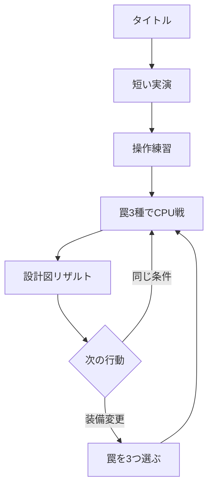

# ワナワナ リッチブラウザゲーム実装計画書

| 項目 | 内容 |
|---|---|
| 文書版 | 0.2（敵対的検証反映版） |
| 作成日 | 2026-08-13 |
| 対象 | `chameleonjp-lab/wanawana` |
| 正式対象 | iPhoneの縦持ち。パソコン操作にも対応 |
| 1.0の対戦形式 | プレイヤー対CPU。オンライン対戦は将来候補 |
| 公開方式 | GitHub Pagesを予定。公開設定は完成判定後 |

> この文書の数値は、外部作品の正解を写したものではない。実装を始めるための初期値であり、最初の試遊と自動対戦の記録から更新する。
>
> 版0.2では、版0.1を「仕様の穴を悪用するプレイヤー」「操作を中断するiPhone」「順序の異なるブラウザ」「失敗する公開処理」の立場から検証した。P0の未定義を実装者の判断へ残さず、合格条件と停止条件へ置き換えた。

## 1. 結論

「ワナワナ」は、銃撃で体力を削る作品ではなく、**罠を置き、相手の動きを読み、弱い誘導弾で進路を変え、複数の罠へつなぐ1対1の対戦ゲーム**として作る。

作品として守る約束は、次の4点とする。

| 約束 | 実装で守ること |
|---|---|
| 見えないが、理不尽ではない | 設置動作、接近時の危険表示、調査、解除、試合後の全配置公開を用意する |
| 自分で連鎖を作れる | 押す、遅くする、吹き飛ばす、落とすという役割を明確に分ける |
| 銃は誘導の道具 | 誘導弾の直接ダメージは0とし、罠でのみ体力が減る |
| 負けが次の知識になる | 結果画面の「設計図」で移動経路、罠の位置、発動順、敗因を見せる |

最初からオンライン対戦を作ると、通信、切断、不正対策が遊びの検証を妨げる。したがって1.0はCPU戦に絞る。同じ画面を二人で見る形式は、隠した罠が見えてしまうため採用しない。オンラインは、CPU戦でコアループの面白さを確認した後に別計画で判断する。

## 2. 4つの責任者から見た完成像

| 視点 | 最も重く見ること | 完成を妨げる状態 |
|---|---|---|
| ゲームプロダクトマネージャー | 初見でも始められ、短い試合を再戦したくなる | 機能は多いが、連鎖を作る前に離脱する |
| ゲームクリエイター | 静かな仕込みから派手な連鎖へ変わる感情の波 | 粒や光は多いが、何が起きたか分からない |
| ゲームデザイナー | 隠す、読む、誘う、解除する選択が公平につながる | 待ち伏せ、射撃、CPUの隠し情報参照だけが強い |
| ゲームシニアエンジニア | ルールと描画を分け、再現できる試合を安全に届ける | 画面速度で勝敗が変わり、修正のたびに別の罠が壊れる |

## 3. ゲームプロダクトマネージャー視点

### 3.1 対象と利用場面

主な対象は、iPhoneで3〜5分の短い対戦を楽しみたい人とする。複雑な入力や長い育成より、読み合い、いたずら、逆転、連鎖の気持ちよさを好む人を想定する。パソコンでも遊べるようにするが、初版の品質判断はiPhoneを優先する。

1.0では、本格的な順位戦、多数のキャラクター収集、課金、アカウント、長い物語を対象にしない。タイトル画面には「対CPU 1対1罠バトル」と明記し、対人戦があるように見せない。

### 3.2 1回の利用体験

初回起動から再戦までを、次の流れに固定する。



通常の1試合は150秒とし、結果確認まで含めて3〜5分を目標にする。初回だけは固定された3種類の罠で始め、装備選択を挟まない。結果画面では「もう一度」を最も押しやすくし、同じ条件ですぐ再戦できるようにする。

### 3.3 開発範囲

| 段階 | 含める内容 | まだ含めない内容 |
|---|---|---|
| 遊びの検証版 | 仮の1面、移動、誘導弾、ハネ板、ビリビリ盤、パカット床、連鎖、単純なCPU | 豪華な画面、装備選択、オンライン |
| 最小構成版 | 仕上げた1面、3罠、調査と解除、公平なCPU、操作練習、設計図リザルト、基本の音と演出 | ポン玉、モヤびん、複数面、順位表 |
| 1.0 | 5罠、3つの180度回転対称な面、CPU難易度3段階、ハネ板＋選択2罠、設定、端末内戦績、軽量表示 | アカウント、課金、公開対戦、観戦、面の自作、オフライン起動 |
| 将来候補 | 合言葉による知人対戦、オフライン起動、片手戦闘補助、再現データ共有、追加罠、外見変更 | 1.0の合格前には着手しない |

3つの闘技場は、別々の大量素材を作るのではなく、共通の舞台部品と照明を再利用して経路だけを変える。動く床などの新しい規則は1.0に入れない。罠の読み合いを先に完成させる。

### 3.4 優先順位

| 優先度 | 判断基準 |
|---|---|
| P0 | 設置、誘導、連鎖、調査、解除、敗因確認が面白く公平である |
| P1 | 初回説明、iPhone操作、CPU戦、終了、結果、再戦が途切れない |
| P2 | 発動、連鎖、決着を音、形、光、キャラクター反応で気持ちよく見せる |
| P3 | 罠、面、難易度、共有用の結果画像を増やす |
| 保留 | オンライン、課金、アカウント、公開順位、通知、利用者制作面 |

「リッチ」は表示量の多さでは判断しない。罠が作動した理由と連鎖の順序が一目で分かり、入力の直後に音と動きが返ることを優先する。

### 3.5 初期の成功指標

数値は初期の合格線とし、20〜30人の初見試遊後に更新する。外部の分析サービスは最初から入れず、個人を特定しない試遊記録を、本人が明示的に選んだ場合だけ端末内から書き出して確認する。

| 観点 | 初期目標 |
|---|---:|
| 初回起動から操作開始まで | 中央値60秒以内 |
| 口頭補助なしの練習完了 | 初見10人中8人以上 |
| 開始した試合の結果到達 | 85%以上 |
| 3試合以内に2罠以上を連鎖 | 初見10人中7人以上 |
| 結果を見て敗因を説明できる | 初見10人中8人以上 |
| 初回試合後に再戦を選ぶ | 50%以上 |
| 通常CPU戦で2罠以上の連鎖が起きる | 100試合中60試合以上 |
| 技術的な停止がない試合 | 98%以上 |

記録するのは、練習の段階、試合開始と終了、技術的中断、罠の設置・発動・解除、最大連鎖、敗因、再戦だけとする。試合開始は戦闘へ入る直前、結果到達は結果状態へ入った時点で別々に数え、途中離脱を成功扱いしない。氏名、自由入力文、正確な移動履歴は永続化も外部送信もしない。再現用の入力列は現在の試合中だけメモリへ置く。

## 4. ゲームクリエイター視点

### 4.1 作品の感情と世界観

目指す体験を、次の一文に定める。

> 静かな読み合いのあと、見えなかった仕掛けが舞台装置のように連鎖し、驚きと笑いが一気に弾ける。

舞台は殺し合いではなく、歯車、ばね、幕、照明で作られた公認競技「ワナワナ・ショー」とする。選手は「仕掛け師」と呼ぶ。敗北時は死亡させず、泡、紙吹雪、捕獲箱などに包まれて退場させる。

起動時の説明は長文にしない。観客の歓声で舞台が点灯し、二人が入場し、床の仕掛けが一度だけ動く5秒ほどの実演で世界を伝える。

### 4.2 美術の方向

固定された斜め見下ろしで、闘技場全体を常に一画面へ収める。戦闘中はカメラを追従、回転、拡大しない。3連鎖以上では舞台照明と額縁だけを強め、人物と危険表示の画面上の位置を動かさない。カメラを寄せてよいのは入力を受けない開始演出と結果だけとする。

木、塗装金属、真鍮、布、紙を使った「機械仕掛けの立体舞台」に統一する。写実的な軍事施設、暗い研究所、残酷な傷を避ける。2次元画像を前後に重ね、影、照明、床の高さ、短い変形で立体感を作る。

床の配置線は常時表示せず、罠を置けるときだけ薄く出す。情報は色だけで分けない。

| 状態 | 画面での伝え方 |
|---|---|
| 自分の罠 | 実線、丸い所属印、罠記号 |
| 発見した敵の罠 | 破線、ひし形の所属印、目の記号 |
| 発動中 | 実際の効果範囲と進行方向を太線で表示 |
| 調査・解除中 | 虫眼鏡または工具と、短い進行表示 |
| 連鎖中 | 光る「仕掛け糸」と発動順の数字 |

「仕掛け糸」は本作を代表する表現にする。連鎖時だけ罠の間を光が走り、`1 → 2 → 3` と番号を出す。敵の罠は発動前には隠すが、発動後の理由は隠さない。

### 4.3 キャラクター

初期は性能と当たり判定が同じ二人を用意する。性能差を付けると、罠の調整と初見理解が難しくなるためである。

| 名前案 | 輪郭と性格 | 制作上の共通部分 |
|---|---|---|
| カチリ | 角張った道具箱を背負う慎重な仕掛け師 | 共通の体、移動、設置、解除、被弾 |
| ポッカ | 丸い保護眼鏡を付けた陽気な仕掛け師 | 頭、上着、道具箱、待機姿勢だけ変更 |

基本動作は、待機、移動、設置、解除、被弾、押し出し、勝利、敗北の8種類に絞る。細かな顔の動きではなく、目の差し替えと体全体の姿勢で感情を見せる。

### 4.4 罠の見た目と音

一般名を説明に添えつつ、画面では固有名を使う。発動時は必ず、形、方向、音の三つをそろえ、見た目の範囲と実際の当たり範囲を一致させる。

| 表示名 | 一般的な役割 | 主な形 | 音の特徴 |
|---|---|---|---|
| ハネ板 | 押し出し床 | 矢印板とばね | 固定具の音、短いばね音 |
| ビリビリ盤 | 地雷 | 開く円盤と電気の輪 | 帯電音、短い破裂音 |
| パカット床 | 落とし穴 | 本のように開く床 | 留め金、落下音 |
| ポン玉 | 爆弾 | 膨らむ球と紙片 | 時計音、低い破裂音 |
| モヤびん | ガス | 弁と渦模様 | 弁、空気が抜ける音 |

相手には、設置者の短い屈み動作と方向を持たない共通音だけを伝える。未発見罠の種類や位置が、煙、影、床の変色、左右の音から漏れないようにする。

### 4.5 音と連鎖演出

音楽は曲数を増やすより、1曲を序盤、罠が増えた状態、残り30秒の3層に分ける。効果音は音楽と別に音量を変えられるようにする。音を消しても、解除、発動、連鎖、決着を記号と短い文字で理解できなければならない。

罠が当たった瞬間は、長い動画ではなく短い反応を重ねる。次の値から調整を始める。

| 演出 | 初期値 | 動きを減らす設定 |
|---|---:|---|
| 発動地点の白い輪郭 | 最低600ミリ秒または連鎖終了まで | 維持 |
| 被弾姿勢の強調 | 50〜70ミリ秒。ルール更新は止めない | 0〜30ミリ秒 |
| 画面揺れ | 画面幅の0.5%以下 | 無効 |
| 決着後の速度低下 | 勝敗確定後0.3〜0.4秒 | 無効 |
| 仕掛け糸と番号 | 連鎖ごと | 維持 |

光の点滅は罠ごとではなく画面全体で数え、どの1秒間にも3回を超えない。追加の発光は点滅ではなく持続輪郭へ置き換える。大きな拡大、揺れ、背景の視差、移動する紙吹雪は端末の「動きを減らす」設定で止める。演出設定は固定更新、当たり判定、入力受付時間、勝敗へ一切影響させない。

### 4.6 少ない素材で豊かに見せる

費用をかける場所は、罠の発動、連鎖、決着の三つに絞る。紙吹雪、火花、煙、衝撃の輪は、小さな画像部品の色、大きさ、回転を変えて再利用する。観客は数種類の影絵をまとまりで動かす。

| 制作対象 | 1.0の上限目安 |
|---|---:|
| 闘技場 | 共通部品による3配置 |
| 照明 | 通常、緊張、決着の3状態 |
| キャラクター | 2人、性能共通 |
| 罠 | 5種類、待機・発見・発動の3状態 |
| 粒と煙の部品 | 12種類前後を共用 |
| 音楽 | 1曲、3層 |
| 効果音 | 20〜25種類 |
| 観客の反応 | 6〜8種類 |

### 4.7 独自性を守る

参考にするのは「見えない仕掛けを置き、誘導し、解除し、連鎖させる」という大きな遊びの構造までとする。既存作品の人物、舞台、罠の造形、固有名、画面構成、地図、数値、文章、画像、音、演出順を再利用しない。

本作固有の軸は「明るい機械仕掛けのショー」「因果を示す仕掛け糸」「作戦を振り返る設計図リザルト」とする。公開前に、作品名と人物名の商標などを別途確認する。この計画書だけで法的な利用可否を断定しない。

## 5. ゲームデザイナー視点

### 5.1 試合規則

| 項目 | 初期仕様 |
|---|---|
| 形式 | プレイヤー対CPUの1対1 |
| 時間 | 150秒 |
| 体力 | 各100 |
| 勝利 | 相手の体力を0にする。体力は罠でのみ減る |
| 時間切れ | 残り体力、相手へ帰属する罠ダメージ、最大連鎖、解除成功数の順で比較し、すべて同値なら引き分け |
| 闘技場 | 9×13マスを基準にした固定画面。移動は連続、罠はマスへ吸着 |
| 人物 | 半径0.32マス、通常移動は毎秒3.2マスから調整 |
| 攻撃対象 | 誘導弾は相手人物だけへ当たる。罠、爆発、モヤは設置者を含む両者へ同じ条件で当たる |
| 同時決着 | 同じ更新で両者の体力が0以下なら引き分け。時間0と同じ更新の効果は効果を先に解決する |

誘導弾は毎秒10マスで飛び、相手を約0.4マス押すが、体力を減らさない。初期の発射間隔は0.65秒、射程は7マスとする。連続で動けなくならないよう、命中後0.4秒は次の誘導弾による押しを受けない。発射時には0.15秒だけ自分の移動速度を40%下げ、逃げながら撃つだけの行動を弱める。1回の押下または指を離す操作につき1発だけ発射し、押し続けても連射しない。

時間切れの延長戦は採用しない。「次の1ダメージ」で罠ごとの強さが消え、待ち伏せをさらに有利にするためである。罠ダメージには、設置者とは別に責任者を持たせる。相手を弾で罠へ押し込んだ場合は押した側、自分で自分の罠へ歩いた場合は自分、外力なしで相手の罠を踏んだ場合は罠の設置者へ帰属させ、結果画面で両方を表示する。

同じ更新で複数の効果が起きた場合、発動候補を接触時刻、対象、罠の固定ID順に並べた後、ダメージと状態変化を一括して適用する。押しは方向ベクトルを合成して上限へ丸める。配列への追加順や先手側だけで勝敗を変えない。

### 5.2 操作

画面下を操作台とし、戦闘画面を指で隠し続けない形にする。標準戦闘は左親指で移動しながら右親指で行動する二本指操作と明記する。タイトル、設定、練習選択、結果は片手で完了できるが、片手だけの戦闘補助は1.0の約束へ含めない。

| 操作 | タッチ | キーボード |
|---|---|---|
| 移動 | 左側の移動パッドをドラッグ | `WASD` または矢印 |
| 誘導弾 | 右側の射撃パッドを押すと予告線を出す。短く離すと自動照準、ドラッグして離すと方向指定。取消域で離すと不発 | マウスで方向、Spaceを離して発射 |
| 罠設置 | 罠札を押すと、その瞬間の現在地に最も近いマスを固定して予告。離すと設置動作、取消域なら中止 | `1`〜`3`で予告、同じキーを離して確定 |
| ハネ板の方向 | 短く押すと向いている4方向。罠札からドラッグすると4方向を選び、足元に矢印を事前表示 | 方向キーを併用 |
| 調査・解除 | 操作台中央の固定ボタンを押し続ける | `E`を押し続ける |

射撃と罠は押した瞬間には確定しない。予告線、予定マス、方向を見て離した時だけ確定し、取消と入力中断では弾や歯車を消費しない。罠の設置は離してから0.30秒の共通動作を行い、その間は移動と射撃を止める。誘導弾で押される、罠効果を受ける、停止状態へ入ると設置を取り消し、歯車を消費しない。成功時だけ歯車を消費し、0.6秒の準備へ入る。

罠を置けない場所で札を離した場合は、資源を消費せず、理由を足元へ短く表示する。敵の未発見罠は設置可否へ影響させず、同じマスへ敵味方の罠が重なることを許可する。これにより、設置の成否を繰り返して隠し罠の位置を探す抜け道を閉じる。自分の罠、壁、出現禁止範囲、相手人物と重なるマスだけを不許可にする。設置者自身との重なりは許可し、準備完了時にも残っていれば自分へ通常どおり発動する。

### 5.3 隠し情報、調査、解除

敵の未発見罠は完全に描画しない。ただし、設置者は共通の0.30秒の設置動作と方向を持たない音を出す。注意して見ていた相手は設置者の周辺マスを推測できる。これは情報漏れではなく、隠し罠へ対抗するための意図した公開情報とする。種類、準備完了時刻、寿命は伝えない。

敵の罠から1.60マス以内へ入ると、方向を示さない危険表示が足元に出し、1.80マスを超えたときに消す。出入りの境界を分け、表示の点滅を防ぐ。「調べる」は最も近い未発見罠を0.65秒で発見し、発見済みの罠へ0.8マス以内なら「解除」を0.9秒で撤去する。解除表示は0.95マスを超えたときに消す。

中央ボタンの場所は試合開始時から予約し、危険がないときは無効表示にする。無効状態で押し始めた指が、途中で有効になっても作動させない。長押し開始時に対象を固定し、進行を人物の上とボタン上部へ表示する。自発的な移動、罠効果、範囲外、停止で進行を取り消す。誘導弾の命中は進行を0.20秒止めるが、それまでの進行を消さない。押し続けるだけで調査と解除を永久に封じられないようにする。

この仕組みにより、罠へ近づくほど情報が増える一方、止まって調べる危険も生まれる。危険表示は方向を教えないため、罠の存在を無効にはしない。

### 5.4 共通資源と設置制限

罠は種類別の複雑な弾数ではなく、共通の「歯車」を使う。

| 項目 | 初期値 |
|---|---:|
| 歯車の最大 | 5 |
| 開始時 | 3 |
| 回復 | 6秒ごとに1 |
| 同時に置ける自分の罠 | 4個 |
| 設置後の準備時間 | 0.6秒 |
| 未発動の寿命 | 30秒 |
| 設置間隔 | 0.35秒 |
| 設置禁止 | 各出現地点から1.5マス、壁、自分の罠と同じマス、相手人物の当たり範囲と重なるマス |

寿命切れは小さな音とともに自分側だけへ表示する。敵側へ位置を漏らさない。敵味方の罠が同じマスにある場合は別IDとして共存し、人物が入れば同じ更新の発動候補になる。罠の効果は設置者にも当たるため、自分の安全地帯を無条件に作れない。

### 5.5 5種類の罠

| 罠 | 費用 | 起動条件・範囲 | 初期効果 | 連鎖での役割 | 主な対処 |
|---|---:|---|---|---|---|
| ハネ板 | 1 | 人物の中心が設置マスへ入る | 選んだ4方向へ2.25マス押す。ダメージ0 | 連鎖を始め、次の罠へ運ぶ | 設置時の向きを覚える。発見して解除 |
| ビリビリ盤 | 2 | 中心から半径0.55マス | 18ダメージ、中心から外へ0.6マス押す | 次の罠へ向きをずらす | 危険表示から調査。接近しない |
| パカット床 | 2 | 中心から半径0.45マス | 26ダメージ、0.8秒退場後に自分側の出現地点へ戻す | 連鎖の終点 | 狭い入口を調べる。押される方向を避ける |
| ポン玉 | 2 | 人物または爆発が半径0.70マスへ入る | 0.75秒後、半径1.40マスへ20ダメージ、中心から外へ押す | 複数方向へ連鎖を広げる | 導火表示を見て範囲外へ移動 |
| モヤびん | 1 | 人物が半径0.60マスへ入る | 半径1.50マスに3.5秒残り、範囲内の移動を30%遅くする。ダメージ0 | 進路を絞り、誘導しやすくする | 早めに範囲外へ出る |

数値はすべて設定ファイルから変更できるようにする。ポン玉だけは、人物の接近に加えて別の爆発でも導火する。ほかの罠同士は直接発動せず、人物が押し込まれたときに発動する。例外を増やさない。

パカット床の退場中は入力と当たり判定を無効にし、時間は進める。戻った後0.50秒はダメージと押しを受けず、同時に移動、射撃、設置、調査もできない。出現禁止範囲により復帰地点へ罠を置けないようにし、復帰狩りと無敵攻撃の両方を防ぐ。モヤびんが重なっても減速は加算せず、最も強い一つだけを適用する。範囲を出た時点で減速を解除する。

1.0の装備はハネ板を共通枠として固定し、残る4種類から2種類を選ぶ。自由な3枠で高ダメージ罠だけを選び、本作の「運ぶ連鎖」を外す支配的な構成を最初から作らないためである。装備率の基準はハネ板100%、残る4種類は均等なら50%とする。

### 5.6 連鎖の数え方

時間が近いだけでは連鎖にしない。各発動イベントへ `eventId`、`chainId`、`parentEventId`、`sourceTrapId`、`responsibleActor` を持たせる。ある罠による強制移動または行動制限が人物を次の罠へ接触させた場合、またはポン玉の爆発が別のポン玉を導火した場合だけ、親子関係を結ぶ。親の効果から1.5秒を超えた発動と、連鎖開始後に新しく準備完了した罠は別の連鎖にする。誘導弾から最初の罠へ押した場合は誘導成功を示すが、連鎖数は罠の個数だけを数える。

連鎖による隠れたダメージ倍率は付けない。複数の罠がそのまま続けて当たること自体を報酬にする。連鎖ごとに観客の反応、仕掛け糸、結果記録を強くする。

同じ罠は1回の発動で消費する。1人4個、両者合計8個が同時に有効になり得るため、1本の連鎖は最大8個であり、8連鎖は合法な成果として最後まで解決する。連鎖表示の最長年齢は8秒とし、それ以降の因果は新しい連鎖として表示するが、効果そのものを捨てない。

安全装置は連鎖数とは別に、1更新128イベント、1試合50,000イベントを初期上限とする。合法な盤面で到達しないことを大量試験で確認し、到達した場合は残りを黙って捨てて勝敗を続けない。その試合を「技術的に無効」として停止し、再現データを保持する。上限到達は正常な決着ではなく公開を止める不具合とする。

### 5.7 闘技場

プレイヤー側とCPU側を入れ替えても同じ条件になるよう、すべて180度回転対称にし、出現地点から重要地点までの距離を同じにする。障害物は誘導弾を遮るが、キャラクターと罠を完全に隠す高い壁は使わない。

| 面 | 役割 | 追加する読み合い |
|---|---|---|
| 大歯車劇場 | 最初の1面。中央が広く、四隅に柱 | 基本の誘導と連鎖 |
| 幕間路地 | 中央に短い壁があり、左右に回り道 | 待ち伏せ位置と解除の危険 |
| ばね回廊 | 固定された丸い衝突物がある | 押し出し方向の工夫 |

ランダムな地形変化や一方だけ得をする出現位置は採用しない。背景、照明、観客は変えても、当たり判定は明確な輪郭を持つ。

### 5.8 CPUの公平性

CPUへ渡す情報を、画面上の見え方をさらに有限の注意と記憶へ変換した「認知情報」に限定する。CPUは自分の罠、発見済みの敵罠、現在見えている人物と弾、気付いた共通設置動作、危険表示だけを受け取る。未発見罠の座標、種類、準備、残り時間を判断処理へ渡さない。

人は設置者の位置を見て罠の周辺を推測できるが、CPUが全設置を完全記憶すると不公平になる。設置動作は `PlacementCue` としてだけCPUへ渡し、罠回避処理が人物の生座標履歴や設置状態から直接推論することを禁止する。Cueは種類を持たない2×2マス程度の疑い領域で、難易度ごとの見落とし率、反応遅延、記憶期限を通す。疑い領域は罠の確定座標として経路探索に使わない。

CPUは、危険回避、調査、解除、資源待ち、設置、誘導、追跡を点数で選ぶ方式にする。難易度は隠し情報ではなく、反応の遅さ、狙いの誤差、記憶時間、何手先まで連鎖を作るかで変える。

| 難易度 | 反応の初期値 | 連鎖計画 | 誤差 |
|---|---:|---|---|
| やさしい | 0.40秒 | 1〜2罠 | 大きい。解除を時々見送る |
| ふつう | 0.28秒 | 2罠 | 中程度 |
| むずかしい | 0.22秒 | 最大3罠 | 小さいが0にはしない |

隠し罠の有無だけを変えた二つの同一状況で、CPUが罠を認知するまでは同じ判断を行う自動テストを必須にする。さらに未発見罠の配列自体をCPU用成果物へ渡さず、Cue生成とCPU判断のモジュール境界を検査する。難易度は反応、誤差、注意、記憶だけを変え、移動速度、資源回復、当たり判定は変えない。

### 5.9 チュートリアルと結果

初回練習は60〜90秒を目標にし、文章を読ませる前に操作させる。

| 段階 | プレイヤーが行うこと | 合格 |
|---|---|---|
| 1 | 移動し、誘導弾で人形を押す | 指定範囲へ押す |
| 2 | ハネ板を置き、人形を乗せる | 押し出し成功 |
| 3 | ハネ板→ビリビリ盤→パカット床を作る | 2罠以上の連鎖成功 |
| 4 | 危険表示から敵罠を調べて解除する | 解除成功 |

練習では歯車を消費しない。失敗後すぐ同じ罠を置き直せるようにし、開始資源3に対して費用合計5を待つだけの時間を作らない。最初に二本指の置き方を実際に試し、2回失敗したら予定位置と指を示し、3回失敗したら短い自動実演を選べるようにする。起動実演には「スキップ」と「もう一度」を付ける。

結果の「設計図リザルト」では、全罠、最後の5秒の移動線、誘導弾、発動順、設置者、責任者、ダメージ、最大連鎖、解除数を表示する。重い動画再生は作らない。記録した試合データから静止した舞台図と短い再現だけを作る。

### 5.10 バランス検査

まず固定された疑似乱数でCPU同士を自動対戦させ、終了不能、場外、無限連鎖、同じ行動の繰り返しを見つける。その後、人の試遊で「理解できるか」「自分の作戦だと感じるか」を確認する。CPU同士の勝率だけで面白さを判断しない。

100試合ごとに、罠の選択率、設置の成功・取消、設置から発動まで、誘導弾の発射・命中、調査の開始・中断、解除率、連鎖への参加率、自滅率を見る。ハネ板は固定、残る4種類から2種類を選ぶため、均等なら選択罠の装備率は50%になる。1種類が75%を超える、または25%を下回る状態が続く場合は、数値だけでなく役割と対処方法を見直す。

通常CPUだけでなく、逃げ続ける、射撃だけを繰り返す、入口で待つ、高ダメージ罠を優先する、調査を連続妨害する敵対方針を用意し、左右を入れ替えた同じseedで対戦させる。単純方針が通常CPUへ55%を超えて勝ち続ける、または人の試遊で同じ行動だけが最善と説明される場合、演出と追加面を止めてルールへ戻る。

## 6. ゲームシニアエンジニア視点

### 6.1 採用する技術

画面を豪華に見せつつiPhoneで安定させるため、3次元エンジンは使わず、2次元画像を重ねる。画面を描く土台として **PixiJS** を使い、WebGLを優先する。WebGLを開始できない場合はPixiJSの2次元Canvas描画へ切り替え、どちらも開始できない場合だけ試合を開始しない。PixiJS公式資料でも、WebGLは安定した推奨方式、WebGPUは実装差が残る方式とされている。

| 領域 | 採用 | 理由 |
|---|---|---|
| 言語 | TypeScript | 罠の状態、原因、公開情報を型で分け、誤参照を減らす |
| 開発と組み立て | Vite | 静的ファイルへ変換し、GitHub Pagesへ出せる |
| 戦闘描画 | PixiJS v8系のWebGL優先、Canvasフォールバック | WebGLを優先し、開始できない端末でも2次元Canvasで試合を続けられる |
| 画面部品 | HTMLとCSS | ボタン、設定、説明、読み上げ、フォーカスをブラウザへ任せる |
| 音 | Web Audio API | 効果音、音量、左右位置、音楽層を制御できる |
| 単体検査 | Vitest | 描画なしでルールとCPUを高速に検査する |
| 一連操作の検査 | Playwright | WebKit、Chromium、タッチ端末相当で開始から再戦まで確認する |
| 公開 | GitHub ActionsとGitHub Pages | `main`合流後だけ静的成果物を公開する |

Reactなどの画面枠組みは初期には入れない。戦闘画面の多くはCanvasであり、タイトルと設定は小規模なHTMLで足りる。依存関係は実装開始時に検証済みの完全な版へ固定し、Node、npm、ロックファイルも登録する。PixiJSの自動検出でWebGLを先に試し、開始できない場合はCanvasへ切り替える。描画方式が変わっても固定tick、入力受理、当たり判定、勝敗、再現記録は変えない。

### 6.2 全体構造

ルール、入力、描画、音を分離する。描画が遅くなっても勝敗が変わらず、演出を減らしても同じ再現データを使える構造にする。

```text
src/
  app/        画面遷移、起動、停止、設定
  core/       固定時間の試合、人物、弾、罠、衝突、勝敗
  ai/         CPUの認知、記憶、行動候補、経路探索
  input/      タッチ、マウス、キーボードを共通命令へ変換
  render/     PixiJSの舞台、人物、罠、光、粒、軽量表示
  ui/         HTMLのタイトル、操作台、設定、結果
  audio/      音の読込、再生、音量、左右位置
  data/       罠、面、難易度の調整値と検査
  replay/     初期値、入力、試合イベント、設計図の生成
tests/
  unit/       ルール、罠、CPU、保存
  simulation/ CPU同士の大量試合
  e2e/        ブラウザでの開始、戦闘、結果、再戦
public/assets/
docs/
```

画面遷移は `起動 → タイトル → 練習または装備 → 開始演出 → 戦闘 → 一時停止 → 結果` の有限状態として管理する。一つの画面に状態判定を散らさない。

### 6.3 再現できる試合

試合の更新は1秒60回の固定間隔とし、描画回数と分ける。ルールが参照できる時間は整数の `tick` だけとする。通常試合は9,000 tick、0.15秒は9 tick、0.20秒は12 tick、0.30秒は18 tick、0.35秒は21 tick、0.40秒は24 tick、0.50秒は30 tick、0.60秒は36 tick、0.65秒は39 tick、0.75秒は45 tick、0.80秒は48 tick、0.90秒は54 tick、1.5秒は90 tick、3.5秒は210 tick、6秒は360 tick、8秒は480 tick、30秒は1,800 tickとして設定へ直接保存する。`core` と `ai` では秒、小数の時刻、`Date.now()`、`performance.now()`、`Math.random()`を参照しない。

位置は1マスを9,600とする整数で保持する。通常移動3.2マス/秒は512単位/tick、弾10マス/秒は1,600単位/tickとなり、更新ごとの端数を残さない。移動と照準は入力層で256方向の整数へ丸め、登録済みの整数表から方向成分を読む。疑似乱数はアルゴリズム名と版を固定し、32ビット整数演算だけで進める。

描画の時刻は処理すべきtick数を決めるためだけに使う。1描画で最大5 tickまで処理し、未処理が8 tickを超えたらtickを捨てたり大量処理したりせず、「処理が遅れました」と性能停止する。画面が隠れた場合は未処理の実時間を捨て、試合時間を進めない。

1 tickの順序を次に固定する。

1. 前tickから持ち越した状態を確定する。
2. 両者の正規化済み命令を人物ID順に適用する。
3. 通常移動、弾、押し出しを線分として進め、壁と罠の最初の接触位置を求める。
4. 接触時刻、対象ID、罠ID順に発動候補を並べる。
5. 同じtickのダメージ、押し、状態変化を一括解決する。
6. 両者の撃破を判定し、その後に試合時間と時間切れを判定する。
7. 認知情報、再現用ハッシュ、表示イベントを作る。

人物、弾、罠、イベントには増加する整数IDを与える。配列、集合、経路探索、衝突候補は明記した比較条件で必ず並べ、追加順やオブジェクト列挙順へ依存しない。ハネ板と爆発の押しは瞬間移動にせず、移動線分の途中にある壁と罠も検査する。

再現データの先頭には `schemaVersion`、`engineVersion`、`buildCommit`、`balanceConfigHash`、`mapHash`、`prngName`、`seed`、`tickRate`、`inputEncodingVersion` を入れる。記録する正本は生の指座標やDOMイベントではなく、各tickで受理した移動、照準、射撃、設置、調査の整数命令である。CPUの受理済み命令も記録し、AIを再実行せず戦闘規則だけを再生できるようにする。300 tickごとの世界状態ハッシュと最終ハッシュを持ち、最初の不一致tickを報告する。

版や調整値が一致しない再現データは、明示した移行処理がない限り再生を拒否する。開発用読込は2MB、11,000 tick、50,000イベントを上限とし、型、整数範囲、配列長を検証する。通常版では再現入力を現在の試合中だけメモリへ置き、次の試合開始またはページ終了時に捨てる。明示した開発用の書き出し操作だけがファイル化できる。

### 6.4 CPUから隠し情報を隔離する

試合の完全な状態を `WorldState`、公開情報を注意、誤差、記憶期限へ通した状態を `PerceivedState` として分ける。CPUが受け取れるのは `PerceivedState` だけとし、型とモジュールの境界で未発見罠へ触れないようにする。`PerceivedState` を作る層とCPU判断を別パッケージにし、CPU側から `WorldState` をimportできない静的規則を置く。

開発用画面では、完全状態の表示を明確な検査モードに限定する。本番成果物では検査モードを無効にし、URLの文字列だけで開けないようにする。ただしCPU戦だけの1.0では、これは不正対策より「公平な設計を壊さない」ための仕切りである。

### 6.5 描画と素材

舞台を、背景、床と障害物、罠、人物と弾、効果、画面表示の順に分ける。動かない背景は毎回描き直す量を減らし、粒は作成と破棄を繰り返さず再利用する。

画像は同じ用途の小画像を1枚へまとめ、読み込み回数と描画切替を減らす。必須素材と追加演出を別のまとまりにし、タイトル表示後に追加素材を裏で読む。必須素材が1件でも失敗した場合は試合を開始せず、HTMLで再試行を案内する。追加演出だけが失敗した場合は軽量表示へ落とし、ルールと情報表示を変えない。

通常表示と軽量表示で、当たり判定、罠の見え方、発動時刻、勝敗は変えない。軽量表示で減らせるのは、粒の数、背景観客、影の細かさ、画面揺れ、照明効果だけとする。通信時の圧縮容量に加え、画像の幅×高さ×4、描画用テクスチャ、Canvas解像度から展開後の概算も組み立て時に検査する。同時常駐する画像と描画用テクスチャは初期64MiB以下、1枚は2048×2048以下とし、不要な面と素材は画面離脱時に明示的に解放する。

### 6.6 iPhoneとブラウザの扱い

タッチ、マウス、ペンを同じ方法で受け取るため、Pointer Eventsを使う。戦闘面と操作台だけ `touch-action: none` とし、ページのスクロール、長押し選択、引っ張って更新が戦闘中に起きないようにする。説明文などゲーム外の画面では、必要以上にブラウザ操作を妨げない。

各指は `pointerdown` した時点で移動、射撃、罠札、調査・解除の役割を固定し、途中で別の役割へ移さない。`setPointerCapture`で領域外の終了も受け取る。一方の指を離してももう一方を消さず、3本目以降は既存入力へ影響させず無視する。`pointerup`、`pointercancel`、`lostpointercapture`、`blur`、`pagehide`、画面非表示、回転、停止、WebGL喪失では、全入力、長押し、射撃予約、キー状態を中立へ戻す。再開後は新しい押下が来るまで動かさない。

入力座標は `clientX/clientY` と操作要素の `getBoundingClientRect()` からCSS座標へ変換し、端末の画素密度を直接掛けない。画面寸法変更では先に停止し、変換を更新してから明示的に再開する。

高さは動くブラウザ操作部を考慮し、動的な画面高と安全領域を使う。上から情報欄、闘技場、罠札、操作台の順に分け、闘技場と指を重ねない。`320×480`、`320×568`、`375×667` CSSピクセルで検査し、安全領域を除いて移動・射撃パッド直径96、罠札高さ48、調査ボタン56、闘技場1マス22、人物の視認輪郭24、発見済み罠記号18 CSSピクセル以上を維持する。足りない場合は装飾と余白を減らし、操作対象を縮めない。主要操作は安全領域に加えて画面端から8 CSSピクセル以上離す。

縦持ちを戦闘の正式対象とする。横向きになったら試合、入力、音を止め、「縦向きに戻してください」と表示する。横向きの縮小画面で戦闘を続けない。縦へ戻り表示領域が安定した後、利用者が「再開」を押して3秒の数え直しを終えた時だけ再開する。タイトル、設定、結果は横向きでも読めるようにする。

別アプリや別タブへ移ったときは、`visibilitychange`、`pagehide`、`blur`を使い、試合、入力、音を同じ停止処理で即時停止する。戻っただけでは自動再開しない。利用者がHTMLの「再開」を押した操作内で音を再開し、その指を戦闘入力へ引き継がず、3秒の数え直し後に再開する。隠れていた時間を試合時間へ加えない。

Safariによる再読込やページ破棄に備え、固定更新の境界で2秒ごとに現在状態、tick、疑似乱数、CPU記憶を版付き一時記録 `wanawana:v1:resume` へ置き換える。生の入力履歴は保存しない。30分以内で型とハッシュが正しい記録だけ「中断した試合を再開」「破棄」として提示し、復帰時の全入力と進行中の長押しは消す。保存できない環境では復帰を保証しないが、通常の試合を止めない。

起動時はWebGLを優先して初期化し、WebGLを開始できない場合はPixiJSのCanvas描画へ切り替える。2次元Canvasも開始できない場合だけ、Canvasの外にあるHTMLで対応外と再試行を表示し、試合を開始しない。WebGLの描画領域を失った場合は `preventDefault()` を呼び、固定更新、描画、音、全入力を止め、HTMLで復旧中と表示する。復帰後はGPU資源と表示木を再生成し、既知の検査画面を1回描けた後にだけ「再開」を有効にする。自動で試合へ戻さない。5秒以内に復帰しない、または同じ試合で2回失われた場合は勝敗と戦績を記録せず技術的無効としてタイトルへ戻す。Canvas描画ではWebGL喪失の復旧待ちは発生しない。黒い画面のまま時間だけが進む状態を許さない。

### 6.7 音、保存、更新

AudioContextはアプリで一つだけ作る。最初の「はじめる」と復帰時の「再開」を押した処理内で `resume()` の完了を確認し、戻っただけでは音を鳴らさない。再開に失敗しても試合を止めず、「音なしで続けます」と表示する。効果音の時刻を攻撃、罠、試合時間の判定に使わず、同じ音の同時再生数に上限を持たせる。音楽と効果音は別々に消せる。端末振動は対応差が大きいため、主要な手応えに使わない。

端末へ保存するのは、音量、軽量表示、動きを減らす設定、練習完了、最良記録、集計した試遊値、直近の中断復帰用状態だけとする。キーは `wanawana:v1:settings`、`wanawana:v1:progress`、`wanawana:v1:summary`、`wanawana:v1:resume` のように作品名と版で始める。GitHub Pages上の別作品と同じoriginになる可能性があるため、`localStorage.clear()`を禁止し、自作品の既知キーだけを削除する。

読み書き、JSON解析、容量超過、保存拒否はすべて例外処理し、版、型、数値範囲、文字列長を検査する。保存できない環境でもメモリ上の初期値で遊べるようにする。設定には「ワナワナの端末内データを消す」を置き、他作品の値を消さない。

1.0はService Workerを登録せず、オフライン起動を約束しない。短いCPU戦の核と更新事故のない公開を先に完成させる。将来追加する場合は `/wanawana/sw.js`、scope `/wanawana/`、cache名 `wanawana-<buildHash>` に限定し、試合中の自動切替と再読込を禁止する。同じbuildHashの必須ファイルを全件取得できた版だけをタイトルまたは結果で利用者が選んで切り替える。この条件を満たす別計画と検査なしにM8へ混ぜない。

### 6.8 見やすさと操作しやすさ

メニュー、設定、結果はHTMLの実ボタンと見出しを使い、キーボードの移動先を見えるようにする。戦闘そのものは位置関係を使うため、読み上げだけで同等に遊べるとは断定しない。それでも、体力、時間、選択罠、危険、解除、勝敗は文字でも更新する。

| 項目 | 基準 |
|---|---|
| 主要操作 | 48×48 CSSピクセル以上 |
| 通常文字の明暗差 | 4.5:1以上 |
| 色の利用 | 色だけに頼らず、形、模様、文字を併用 |
| 重要な図形の明暗差 | 隣接背景に対して3:1以上 |
| 点滅 | 1秒に3回を超えない |
| 動きを減らす | 初回描画前から設定を反映し、揺れ、寄り、視差、紙吹雪、速度低下を止めても情報を維持 |
| 音なし | 危険、設置、導火、発動、解除中断、連鎖順、残り30秒、決着を画面で判断可能 |

設定は単独だけでなく、「音なし＋動きを減らす＋軽量表示＋グレースケール」を同時に有効にして検査する。仕掛け糸と番号は連鎖終了後1秒残し、必要情報を一瞬の音や40ミリ秒の発光だけへ預けない。

### 6.9 性能目標

性能値は開発用計測で確認する目標であり、端末やブラウザによって変わる。勝敗処理は描画速度から独立させる。

| 対象 | 通常目標 | 合格下限 |
|---|---:|---:|
| iPhone 17 Pro | 通常表示で60フレーム/秒を目指す | 間隔の95%が20ms以下、99%が34ms以下、100ms超0回 |
| iPhone 11 Pro、iPad Pro 2018 | 軽量表示で30以上 | 間隔の95%が34ms以下、99%が67ms以下、150ms超0回 |
| 幅320 CSSピクセル相当 | 横スクロールなし | 全主要操作が画面内 |
| 初回に必要な圧縮済みデータ | 3MB以内を目標 | 5MBを超えたら分割を必須検討 |
| 全素材 | 8MB以内を目標 | 増加理由を記録 |

描画解像度は端末の画素密度をそのまま無制限に使わず、通常は最大2倍、軽量表示は最大1.25倍から調整する。通常の粒は同時250個、軽量表示は100個を初期上限とする。最悪条件として両者合計8罠、モヤ2範囲、弾上限、最大粒、観客、連鎖表示を同時に出す150秒の検査試合を用意する。M6とM8で本番成果物を実機5試合連続で測り、端末、OS、Safari版、commit、設定を記録する。Playwrightの端末再現を性能合格の根拠にしない。

入力受理から最初の視覚反応まで、通常表示の95%を50ms以下、軽量表示を100ms以下とする。5試合後に表示物、読込素材、AudioNode、イベント登録数が単調増加しないことも確認する。性能未達では粒、観客、追加照明の順で減らし、連鎖中にCanvas解像度を変えない。M8で下限を満たせなければ公開しない。

### 6.10 検査と継続的な確認

GitHubへ出す変更ごとに、次の自動確認を行う。

| 層 | 主な検査 |
|---|---|
| 型と書式 | TypeScriptの型確認、静的な規則、未使用コード |
| ルール | 設置の予告・取消・中断、準備、発動、調査、解除、自滅、同時撃破、時間0との同時効果、引き分け順 |
| 連鎖 | 因果のある2〜8連鎖、無関係な同時発動の分離、敵味方同一マス、ポン玉導火、パカット床、上限到達の無効化 |
| 決定論 | Node、Chromium、WebKit、描画0/30/60/120相当、停止ありで300 tickごとの状態ハッシュと最終ハッシュが一致 |
| 公平性 | CPU成果物に未発見罠がない、Cue前の判断が同じ、面と入力を180度回した試合の結果が一致 |
| 敵対方針 | 逃走、射撃連打、入口待ち、高火力優先、調査妨害が通常方針を支配しない |
| 大量試合 | PRで10,000 seedの短縮試験、mainまたは定期検査で100,000 seedと5種の長時間試験 |
| 入力 | 二本指、3本目、領域外、`pointercancel`、捕捉喪失、回転、別タブ、キー押下中のblurを1,000系列 |
| ブラウザ | 本番成果物でタイトル、練習、戦闘、停止、復帰、結果、再戦、保存拒否、音拒否、WebGL初期化・喪失 |
| 表示 | WebKit相当、Chromium、320×480/568、375×667、設定4種同時、404と黒画面なし |
| 成果物 | 容量、展開後概算、参照切れ、CSP違反、console error、`/wanawana/`配下のURL、全ファイルのSHA-256 |

決定論検査では、同じseedと受理済み命令を、描画頻度を変えて再生する。内部のエンティティ追加順を乱しても一致させ、ハネ板の移動線上の罠、壁際、同時爆発、同時撃破、時間切れ境界を個別に検査する。`core` と `ai` から実時間、`Math.random()`、三角関数を呼ぶ変更を静的に拒否する。不一致、合法状態でのイベント上限到達、未定義の同時結果が1件でもあればM3と公開を止める。

Playwrightの端末再現は、画面寸法、タッチ、利用者情報などの機能検査に使うが、実物と同じ性能やSafariの全挙動を保証するものとして扱わない。M2、M5、M6、M8では実物のiPhoneを使い、Safariの操作部が大きい状態と小さい状態の両方を確認する。ブラウザ自動検査の失敗をretry成功で隠さない。

### 6.11 公開、安全、権利

GitHub PagesはHTML、CSS、JavaScriptなどの静的ファイルを公開する場所であり、秘密の処理を置けない。1.0は通信先を持たず、秘密鍵や管理用の値をコードへ入れない。`VITE_`で始まる値も公開される前提で扱う。

依存関係は必要最小限にし、完全な版、ロックファイル、ライセンス一覧、画像・音・書体の出所を登録する。CIは `npm ci` だけを使い、依存更新は専用PRで差分、既知の脆弱性、ライセンス、容量を確認する。自動更新を自動合流しない。GitHub Actionsの外部Actionは完全なcommit SHAへ固定する。

外部の画像配信先や分析先を使わず、同じ公開元から素材を読む。利用者の文字を `innerHTML` へ挿入しない。本番HTMLには実装可能な範囲で `default-src 'self'; script-src 'self'; style-src 'self'; img-src 'self' data:; media-src 'self'; font-src 'self'; connect-src 'self'; worker-src 'self'; object-src 'none'; base-uri 'none'; form-action 'none'` のCSPをmetaで置く。インラインイベント、`eval`、外部CDNを使わない。

公開はGitHub Actionsで、型確認、単体検査、ブラウザ検査、本番組み立てが成功した `main` だけを対象にする。通常jobは `contents: read` だけ、deploy jobだけ `pages: write` と `id-token: write` を持つ。CIは `dist` を一度だけ作り、その同じ `dist` を `/wanawana/` で配信して全検査を行い、commit、buildHash、全ファイルのSHA-256一覧を添えてPages artifactへする。deploy jobで再構築しない。検査したartifactと公開artifactのhashが違う場合は公開しない。Viteの公開先は `base: '/wanawana/'` とする。計画作成時点では公開設定を有効にしない。

## 7. 実装の順序

日数を先に固定すると、面白さの検証を飛ばす原因になる。各段階を小さなプルリクエストへ分け、合格条件を満たしてから次へ進む。敵対的検証で入力、決定論、失敗復帰を独立作業へしたため、全体は18〜30件ほどの変更を想定する。遊びの検証結果で増減する。

| 段階 | 主な成果 | 目安PR数 | 次へ進む条件 |
|---|---|---:|---|
| M0 基準固定 | 同時裁定、tick、整数単位、因果、再現形式、保存namespace、保留範囲 | 1 | P0の未定義がなく、境界値の検査表がある |
| M1 土台 | Vite、TypeScript、PixiJS、状態遷移、同一artifact CI、WebGL優先・Canvas切替・描画不能表示 | 2〜3 | 本番成果物がWebKit相当で起動し、停止・再開・描画方式切替・失敗表示ができる |
| M2 操作と舞台 | 移動、誘導弾、衝突、3寸法、二本指、全中断、固定調査ボタン | 2〜3 | 1,000中断系列で入力が残らず、実機で寸法基準を満たす |
| M3 連鎖の縦切り | 設置契約、ハネ板、ビリビリ盤、パカット床、因果付き2〜3連鎖 | 2〜4 | 10人中7人が3回以内に意図した連鎖を作り、全環境の状態hashが一致 |
| M4 試合とCPU | 体力、時間切れ、同時決着、認知Cue、公平なCPU、敵対方針 | 2〜4 | CPUが隠し情報を使わず、単純方針に支配されず1,000試合終了する |
| M5 理解と公平性 | 調査、解除、中断復帰、練習、設計図リザルト、再戦 | 2〜3 | 初見試遊で設置者・責任者・連鎖・敗因を説明できる |
| M6 リッチ化 | 固有美術、人物、仕掛け糸、粒、音楽層、効果音、軽量表示 | 3〜5 | 音なし・動きを減らす設定でも発動順が分かる |
| M7 1.0内容 | ポン玉、モヤびん、3面、装備、3難易度、端末内戦績 | 2〜4 | 100試合で支配的な罠と終了不能がない |
| M8 公開品質 | 実機性能、権利一覧、更新案内、公開手順、独立確認 | 2〜3 | 1.0完成条件をすべて満たす。同一artifact以外は公開しない |

M3の時点で、10人中7人が3回以内に意図した2罠連鎖を作れない、10人中8人が偶然と意図した連鎖を区別できない、または「罠へ誘うより直接追うほうが楽しい」という結果が続く場合、演出制作を止める。誘導弾、面の広さ、罠の設置、警告距離を戻って直し、遊びの核が未確認のまま素材を増やさない。

## 8. 最初に作る作業項目

| ID | 作業 | 依存 | 完了の確認 |
|---|---|---|---|
| WW-001 | プロジェクト、型確認、単体検査、本番組み立てを作る | なし | 1命令で検査と組み立てが成功 |
| WW-002 | 起動、タイトル、戦闘、停止、結果の状態を作る | 001 | 不正な画面遷移を単体検査で拒否 |
| WW-003 | 整数tick、正規化入力、線分衝突、状態hashを作る | 001 | Node、Chromium、WebKitと描画頻度違いで一致 |
| WW-004 | 二本指とキーボードを共通命令へ変換する | 003 | 1,000中断系列、3本目、回転後も入力が残らない |
| WW-005 | 誘導弾と連続押し防止を作る | 003 | 体力を減らさず、壁と人物へ正しく当たる |
| WW-006 | 予告・取消・中断を含む罠状態と歯車を作る | 003,004 | 未発見罠で設置成否が変わらず、成功時だけ消費 |
| WW-007 | ハネ板、ビリビリ盤、パカット床を作る | 006 | 自分も発動し、2〜3連鎖が成立 |
| WW-008 | 因果イベント、同時裁定、版付き再現データを作る | 007 | 無関係な同時発動を分け、境界状態hashが一致 |
| WW-009 | Cueと認知情報だけを見るCPUを作る | 008 | 隠し罠を変えてもCue前の判断が同じ |
| WW-010 | 固定ボタンの調査、解除、危険表示を作る | 007 | 境界で点滅せず、射撃連打で進行を永久消去できない |
| WW-011 | 練習と設計図リザルトを作る | 008,010 | 初回4段階と同条件再戦が完走 |
| WW-012 | 仮素材のまま敵対方針と最初の節目試遊を行う | 009,011 | M3/M5の停止条件を記録し、継続判断を残す |

## 9. 主な危険と止める基準

| 危険 | 早期の兆候 | 対応または中止条件 |
|---|---|---|
| 見えない罠が理不尽 | 敗因を説明できる人が80%未満 | 演出追加を止め、設置動作、危険表示、調査、結果を直す |
| 誘導弾や待ち伏せだけが強い | 2罠連鎖が100戦中60戦未満 | 弾の間隔、罠寿命、資源、面の逃げ道を調整 |
| 操作が多い | 誤設置、射撃失敗、指で画面が隠れる | 罠は現在地設置を維持し、常時ボタンを増やさない |
| CPUがずるく見える | 未発見罠だけを避ける動きが出る | 認知境界の検査が通るまで難易度調整を止める |
| 設置で隠し罠を探索できる | 見えない罠のマスだけ設置失敗する | 敵罠を設置可否から外し、同一マスの同時発動を検査 |
| 射撃で解除を封鎖できる | 防御側が近くにいるだけで解除率が0になる | 弾は進行を一時停止だけにし、敵対方針で再検査 |
| 順序で勝敗が変わる | 左右交換やブラウザ変更で状態hashがずれる | 同時一括解決と固定ID順を直すまでM3を止める |
| リッチ化で読めなくなる | 録画で連鎖順を誤認する | 粒より範囲線、仕掛け糸、番号を前面へ戻す |
| 二本指が残る・混線する | 回転や通知後に勝手に移動・発射する | 全中断で中立化し、1件でも再現すればM2を止める |
| iPhoneで熱や遅さが出る | 3秒以上30未満、入力遅れ、描画消失 | 自動軽量化、解像度制限、粒の上限を先に直す |
| 公開物が検査物と違う | deployで再構築、artifact hash不一致 | 公開を止め、検査済みdistだけを配る |
| 規模が膨らむ | M3未合格で面や人物を増やす | オンラインと追加内容を閉じ、現在の門を満たす |
| 既存作品に似すぎる | 固有名、画面、罠造形の一致 | 素材制作を止め、独自性と権利一覧を再確認 |

## 10. 完成条件

### 10.1 最小構成版

- 10回連続で、開始、戦闘、撃破または時間切れ、結果、再戦まで操作不能にならない。
- 3罠をプレイヤーとCPUが設置、発動、調査、解除できる。
- 誘導弾またはハネ板から2罠以上へつなぐ連鎖を、練習と本戦で成立させられる。
- CPUは未発見罠を参照せず、プレイヤーと同じ危険表示と調査を使う。
- 二本指中に片方を取消しても他方だけ継続し、回転、別アプリ、描画喪失から戻った直後に入力と時間が進んでいない。
- 同じseedと受理済み入力をNode、Chromium、WebKitで再生し、全checkpointと最終状態hashが一致する。
- 結果で全罠、発動順、設置者、責任者、最後の移動線、主な敗因を確認し、同条件で再戦できる。
- 初見10人中8人が口頭補助なしで最初の試合を終え、7人が3試合以内に連鎖を成功させる。

### 10.2 1.0公開候補

- 5罠、3面、3難易度、3罠装備、練習、設定、戦績、結果が一つの流れで動く。
- 20人以上の初見試遊で、開始時間、練習完了、敗因理解、再戦意欲の目標を満たす。
- PRの10,000 seedとmainの100,000 seedで、停止、場外残留、無限処理、合法状態のイベント上限到達、終了不能がない。
- 100回以上の人または検証用試合で、常に選ばれる罠、使われない罠、対処不能な組合せがない。
- 通常、軽量、動きを減らす、音なしを同時に有効にしても勝敗と必要情報が変わらず、初見10人中8人が発動罠、連鎖順、解除中断、勝敗理由を説明できる。
- iPhone縦持ちで最後まで遊べ、320×480、320×568、375×667とパソコンで操作不能にならない。
- WebGL喪失、画面回転、別アプリ移動、保存破損から黒画面や進行不能にならない。
- 最悪条件の実機5試合で性能下限を満たし、表示物、素材、AudioNode、イベント登録数が試合ごとに増え続けない。
- 画像、音、書体、コードの出所と利用条件が一覧化され、既存作品の素材を再利用していない。
- Actionの完全SHA固定、最小権限、CSP、参照切れ、hash一致を含む自動確認を通過した同一成果物だけがGitHub Pagesへ公開される。
- 公開説明に、CPU戦であること、保存範囲、未実装のオンライン要素を正確に記載する。

## 11. 運用の決まり

計画と実装が食い違った場合、黙ってコードへ合わせない。ルールや範囲を変える変更では、この文書と調整履歴を同じ変更内で更新する。罠の数値変更には、変更前後、理由、確認した試合数を残す。

各変更はDraftプルリクエストとして作り、自動確認を通す。毎回の実機確認は行わず、M2、M5、M6、M8の節目でiPhoneを確認する。公開前には、実装を担当していない視点で、遊び、公平性、操作、性能、権利をもう一度確認する。

## 12. 敵対的検証の記録

版0.2では、次の攻撃または失敗を実際に起こす前提で版0.1を読み直した。各項目は文章上の注意ではなく、仕様、作業、検査、停止条件のいずれかへ反映済みである。

| 重大度 | 版0.1の破綻点 | 版0.2の対応 | 実装を止める証拠 |
|---|---|---|---|
| P0 | 同時発動、同時撃破、時間0の順序がない | tick内一括解決、固定順、両者撃破は引き分け | 左右交換または環境差でhash不一致 |
| P0 | 時刻だけ近い無関係な罠も連鎖になる | 親イベントと責任者を持つ因果グラフ | 親のない発動が同じchainIdになる |
| P0 | 未発見罠が設置失敗を返し、位置探索に使える | 敵罠を設置可否から外し同一マスを許可 | 隠し罠の有無で設置結果が変わる |
| P0 | 0ダメージ弾で調査・解除を永久リセットできる | 弾は0.20秒停止だけ、進行は保持 | 妨害方針により解除成功率が0へ張り付く |
| P0 | 320幅だけを見て高さ、指、二本指中断を見ていない | 3寸法の最小値、指の役割固定、全中断中立化 | 実機で重なり、押しっぱなし、役割混線 |
| P0 | 1マス1024では3.2マス/秒を整数更新できない | 1マス9600、tick定数、256方向、状態hash | Node/Chromium/WebKitでhash不一致 |
| P0 | WebGL初期化失敗と喪失後の復旧完了が判定できない | HTML退避、GPU資源再生成、手動再開 | 黒画面、喪失中tick進行、古い資源参照 |
| P0 | CIで検査後に別の成果物を作って公開できる | dist一回生成、SHA-256一覧、artifactだけをdeploy | 検査時と公開時のartifact hash不一致 |
| P1 | 延長の次ダメージ勝負が待ち伏せを強める | 150秒で終了し複数の公開値で引き分け判定 | 延長コードまたは非公開値で勝敗が変わる |
| P1 | 高ダメージ3罠で「運ぶ連鎖」を外せる | ハネ板固定＋残り2罠選択 | 単純高火力方針が通常方針へ55%超で勝つ |
| P1 | 戦闘演出の停止量が設定で違い、結果を変え得る | ルールを止めない表示だけの強調 | 設定違いで状態hashまたは入力受付が変わる |
| P1 | オフライン更新が1.0の核と同時進行する | Service Workerを1.0から外し別計画へ | 1.0成果物がService Workerを登録する |

検証で仕様値を変更した箇所は、試遊で元へ戻すことがあり得る。ただし、同時裁定、情報境界、決定論、入力中立化、同一artifact公開は調整値ではなく品質契約であり、試遊結果を理由に外さない。

## 13. 判断の根拠にした公式資料

- [PixiJS Renderers](https://pixijs.com/8.x/guides/components/renderers) — 本番ではWebGLが推奨され、WebGPUにはブラウザ差が残る。
- [PixiJS Assets](https://pixijs.com/8.x/guides/components/assets) — 非同期読込、キャッシュ、素材のまとまり、背景読込。
- [Vite: 静的サイトのデプロイ](https://ja.vite.dev/guide/static-deploy.html) — GitHub Pagesではリポジトリ名を含む`base`とGitHub Actionsが必要。
- [GitHub Pagesとは](https://docs.github.com/en/pages/getting-started-with-github-pages/what-is-github-pages) — HTML、CSS、JavaScriptなどを公開する静的ホスティング。
- [MDN: Pointer events](https://developer.mozilla.org/en-US/docs/Web/API/Pointer_events) — タッチ、マウス、ペンを共通の入力として扱う。
- [MDN: pointercancel](https://developer.mozilla.org/en-US/docs/Web/API/Element/pointercancel_event) — OS判断や多すぎる接触で入力が取り消される場合がある。
- [MDN: Page Visibility API](https://developer.mozilla.org/en-US/docs/Web/API/Page_Visibility_API) — 画面が隠れた状態を検知し、処理と音を止める。
- [MDN: Web Audio API best practices](https://developer.mozilla.org/en-US/docs/Web/API/Web_Audio_API/Best_practices) — 利用者の操作内で音を開始し、音量操作を用意する。
- [MDN: prefers-reduced-motion](https://developer.mozilla.org/en-US/docs/Web/CSS/Reference/At-rules/%40media/prefers-reduced-motion) — 端末の動きを減らす指定を検知する。
- [MDN: CSS環境変数](https://developer.mozilla.org/en-US/docs/Web/CSS/Guides/Environment_variables/Using) — iPhoneなどの安全領域を避けて配置する。
- [MDN: WebGL context lost](https://developer.mozilla.org/en-US/docs/Web/API/HTMLCanvasElement/webglcontextlost_event) — 描画領域を失ったときの検知。
- [WebGL仕様: Context Lost](https://registry.khronos.org/webgl/specs/latest/1.0/#5.15.2) — 復帰を許可する処理と、復帰後に資源を作り直す契約。
- [MDN: localStorage](https://developer.mozilla.org/en-US/docs/Web/API/Window/localStorage) — 保存はorigin単位であり、拒否時の例外を扱う必要がある。
- [Playwright: Emulation](https://playwright.dev/docs/emulation) — タッチ、画面寸法、端末相当のブラウザ検査。
- [W3C: Target Size (Enhanced)](https://www.w3.org/WAI/WCAG22/Understanding/target-size-enhanced) — 44×44 CSSピクセルの操作対象。
- [W3C: Contrast (Minimum)](https://www.w3.org/WAI/WCAG22/Understanding/contrast-minimum.html) — 通常文字の明暗差4.5:1。
- [W3C: Non-text Contrast](https://www.w3.org/WAI/WCAG22/Understanding/non-text-contrast.html) — 重要な操作部品と図形の明暗差3:1。
- [W3C: Three Flashes](https://www.w3.org/WAI/WCAG22/Understanding/three-flashes.html) — 1秒に3回を超える点滅を避ける。
- [npm ci](https://docs.npmjs.com/cli/v11/commands/npm-ci) — ロックファイルを変更せず、食い違いを失敗にする導入。
- [GitHub Actions: Secure use](https://docs.github.com/en/actions/reference/security/secure-use) — 外部Actionを完全なcommit SHAへ固定する。
- [GitHub Pages: Custom workflows](https://docs.github.com/en/pages/getting-started-with-github-pages/using-custom-workflows-with-github-pages) — Pages artifactと公開jobの権限。

---

この計画は、機能を全部作る約束ではなく、面白さと公平性を順番に確かめるための基準である。最初の重要な判断点はM3であり、仮素材のまま「罠を仕込み、誘導して連鎖させること自体が楽しいか」を確認する。
